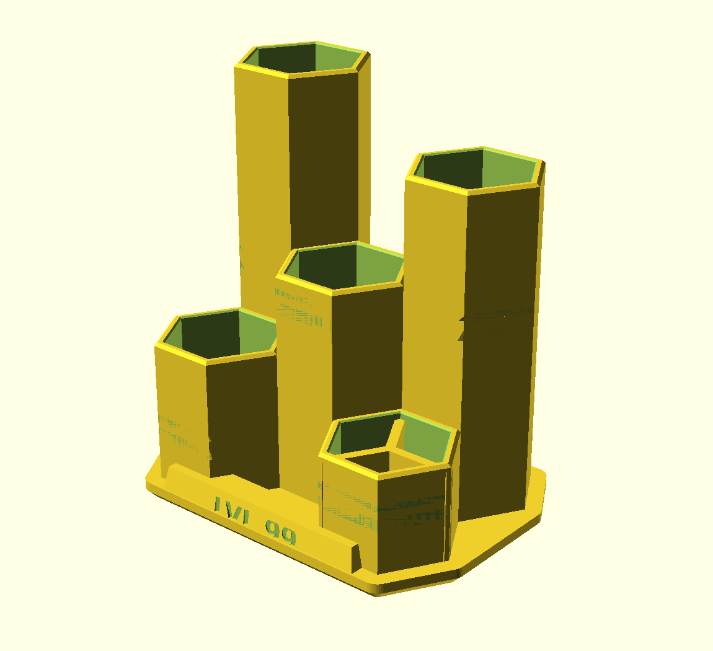
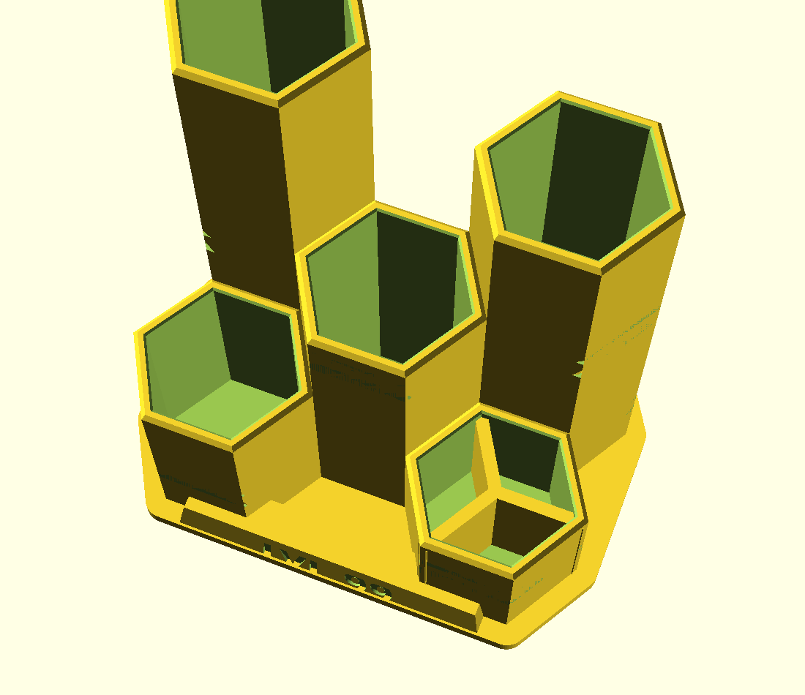
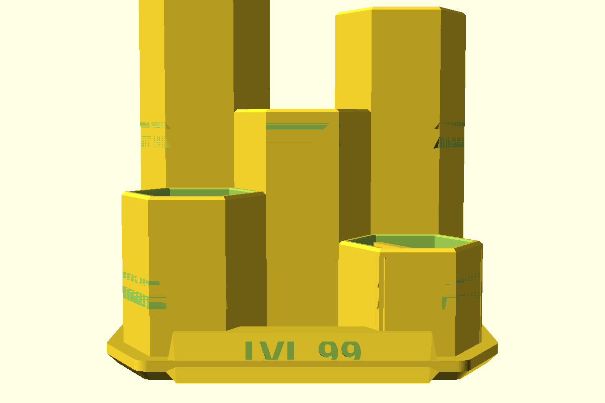
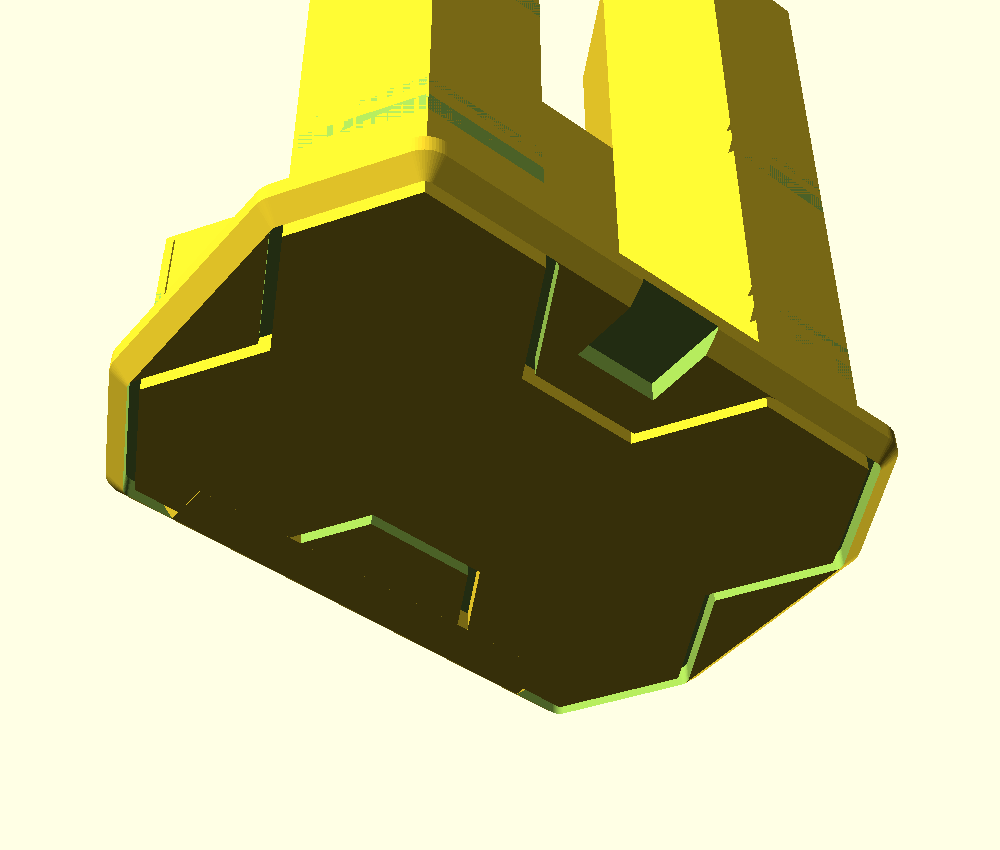

# HEX — Stiftbox im Gaming-Style

Fünf Wabenzellen in gestuften Höhen auf einer Waben-Plattform. Ein Teil, druckt
aufrecht, **ohne Stützstrukturen**.



## Fächer

| Zelle | Höhe | Tiefe innen | gedacht für |
|---|---|---|---|
| hinten links | 105 mm | 100 mm | Stifte, Bleistifte — hier stehen sie hoch genug, um sie zu greifen |
| hinten rechts | 88 mm | 83 mm | Marker, Textmarker |
| Mitte | 62 mm | 57 mm | Schere, Kleber, Cutter, Ladekabel |
| vorn links | 42 mm | 37 mm | Radierer, Spitzer, Kleinkram |
| vorn rechts | 30 mm | 25 mm | **dreigeteilt** — USB-Sticks, SD-Karten, Büroklammern |

Jede Zelle hat 26 mm Schlüsselweite, das sind rund 585 mm² Grundfläche — in die
beiden hohen passen je etwa acht Stifte. Die Staffelung ist Absicht: hinten hoch,
vorn flach, damit nichts verdeckt wird und man an alles drankommt.

 

## Maße und Druck

| | |
|---|---|
| Grundfläche | 96 × 69 mm |
| Höhe | 105 mm |
| Wandstärke | 2,2 mm (zwischen zwei Zellen 4,4) |
| Material | 97 cm³ ≈ 120 g |
| Druckzeit | ca. 9–11 h |

| Einstellung | Wert |
|---|---|
| Material | PLA reicht völlig — steht trocken und warm, trägt keine Last |
| Schichthöhe | 0,2 mm |
| Perimeter | 3 (die Wand ist ohnehin fast massiv) |
| Infill | 10–15 %, wird kaum gebraucht |
| Stützen | **keine** |
| Brim | nicht nötig, die Sockelfläche ist groß |

Geprüft: einzige Fläche über 45° Überhang ist die Decke der LED-Nut — eine 8 mm
breite Brücke, die jeder Drucker sauber zieht. Alle Fasen sind exakt 45°, auch
die Dächer der Rillen und die Einführtrichter an den Zellenrändern.

**Zweifarbig drucken:** Bei `z = 5 mm` einen Filamentwechsel einfügen (M600 oder
die Pause-Funktion des Slicers), dann ist der Sockel in der einen und der
Waben-Turm in der anderen Farbe. Mattschwarz mit einem kräftigen Akzent sieht am
besten aus.

## Gravur / Name

Das Frontschild ist per Voreinstellung glatt. Mit Gamertag:

```bash
openscad -D 'schrift="LVL 99"' -o stiftbox.stl stiftbox.scad
```

Passt bis etwa 10 Zeichen. Wird es zu breit, `schild_b` vergrößern oder
`schrift_h` verkleinern.

## LED-Nut

Auf der Unterseite läuft eine 8 × 3 mm Nut rundum, hinten mit Kabelaustritt.
Darin sitzt ein **8-mm-LED-Strip (5 V, USB)**. Die untere Fase ist so gelegt, dass
das Licht nach außen-unten austritt und die Box auf dem Schreibtisch schwebt.
Kein Strip zur Hand? Die Nut sieht man nicht, sie stört nicht — oder mit
`led_kanal = false` weglassen.



## Anpassen

Alles steht oben in `stiftbox.scad`. Die Zellen sind eine Liste:

```
// [x, y, Höhe, Y-Teiler]
zellen = [
    [-px,  py/2, 105, false],
    [ px,  py/2,  88, false],
    [  0,     0,  62, false],
    [-px, -py/2,  42, false],
    [ px, -py/2,  30, true ]
];
```

* **Andere Höhen:** dritte Spalte ändern — das ist der schnellste Weg, die
  Silhouette umzubauen.
* **Mehr Zellen:** Zeile ergänzen. Das Raster ist `px = 25,3` in x und
  `py = 30,4` in y, Nachbarspalten sind um `py/2` versetzt.
* **Weniger Druckzeit:** die hohen Türme kürzen. 105 → 85 spart rund 1,5 h.
* **Dickere Stifte / Pinsel:** `zelle_w` erhöhen (alles andere wächst mit).
* **Mehr geteilte Fächer:** vierte Spalte auf `true`.
