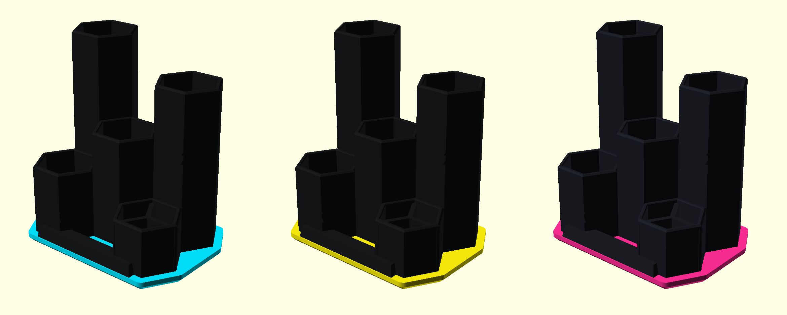
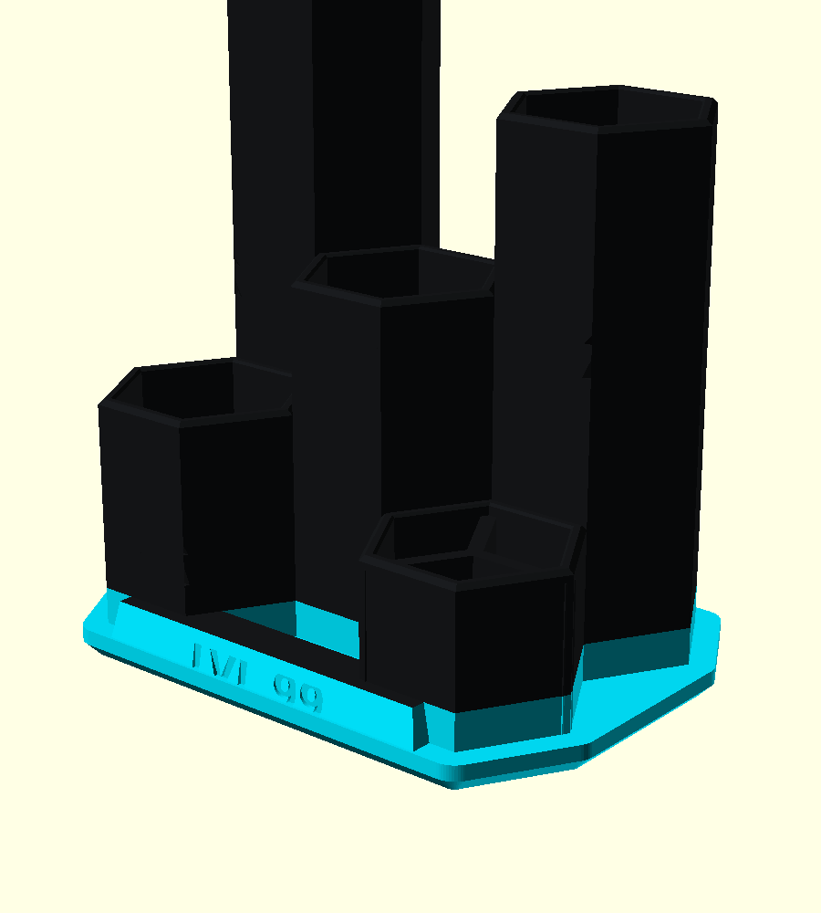
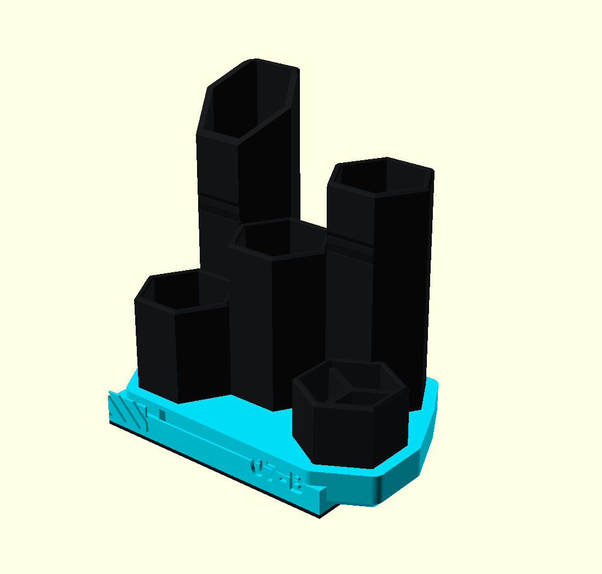
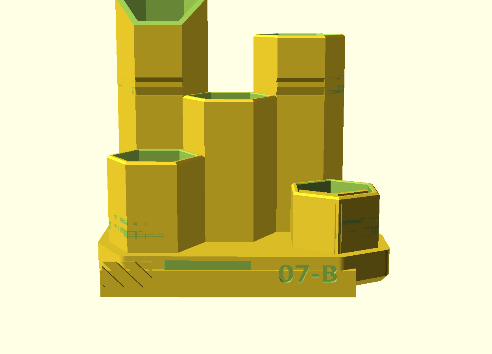
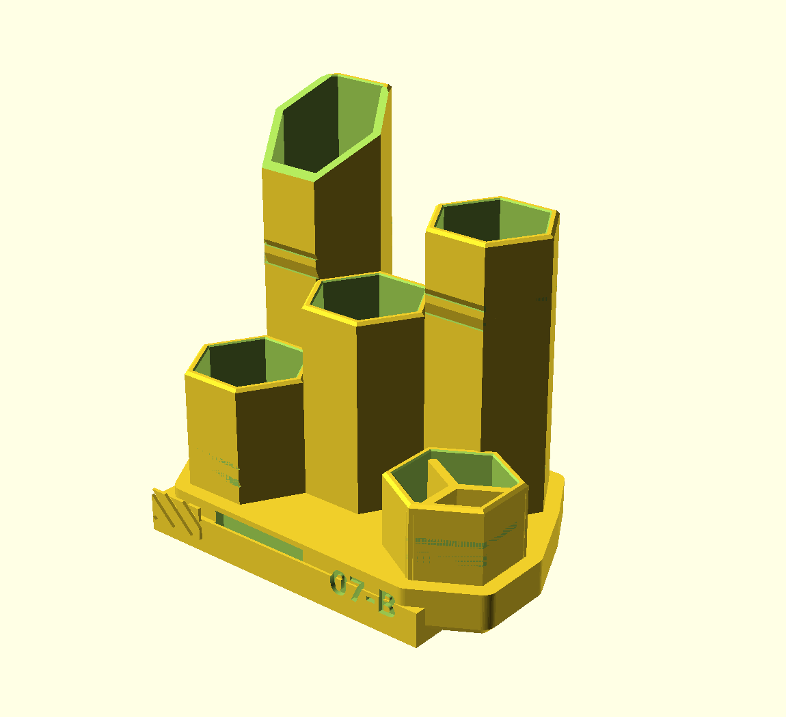

# HEX — Stiftbox im Gaming-Style

Fünf Wabenzellen in gestuften Höhen auf einer Waben-Plattform. Ein Teil, druckt
aufrecht, **ohne Stützstrukturen**.


## Fächer

| Zelle | Höhe | Tiefe innen | gedacht für |
|---|---|---|---|
| hinten links | 105 mm | 100 mm | Stifte, Bleistifte — hier stehen sie hoch genug, um sie zu greifen |
| hinten rechts | 88 mm | 83 mm | Marker, Textmarker |
| Mitte | 62 mm | 57 mm | Schere, Kleber, Cutter, Ladekabel |
| vorn links | 42 mm | 37 mm | Radierer, Spitzer, Kleinkram |
| vorn rechts | 30 mm | 25 mm | **dreigeteilt** — USB-Sticks, SD-Karten, Büroklammern |

Jede Zelle hat 26 mm Schlüsselweite, das sind rund 585 mm² Grundfläche — in die
beiden hohen passen je etwa acht Stifte. Die Staffelung ist Absicht: hinten hoch,
vorn flach, damit nichts verdeckt wird und man an alles drankommt.

 

## Maße und Druck

| | |
|---|---|
| Grundfläche | 96 × 69 mm |
| Höhe | 105 mm |
| Wandstärke | 2,2 mm (zwischen zwei Zellen 4,4) |
| Material | 97 cm³ ≈ 120 g |
| Druckzeit | ca. 9–11 h |

| Einstellung | Wert |
|---|---|
| Material | PLA reicht völlig — steht trocken und warm, trägt keine Last |
| Schichthöhe | 0,2 mm |
| Perimeter | 3 (die Wand ist ohnehin fast massiv) |
| Infill | 10–15 %, wird kaum gebraucht |
| Stützen | **keine** |
| Brim | nicht nötig, die Sockelfläche ist groß |

Geprüft: einzige Fläche über 45° Überhang ist die Decke der LED-Nut — eine 8 mm
breite Brücke, die jeder Drucker sauber zieht. Alle Fasen sind exakt 45°, auch
die Dächer der Rillen und die Einführtrichter an den Zellenrändern.

## Zweifarbig drucken

Mattschwarz für die Türme, ein gesättigter Neonton für den Sockel. Der
Filamentwechsel gehört auf **z = 11 mm**, nicht auf 5 — dann liegen Sockel *und*
Frontschild samt Gravur im Akzentton. Bei 5 mm bleibt nur ein dünner Streifen
übrig, das trägt nicht.



| Schema | Sockel | Türme |
|---|---|---|
| Neon Noir | Cyan transluzent `#00E5FF` | Mattschwarz `#16181A` |
| 2077 | Neongelb `#FCEE0A` | Mattschwarz `#16181A` |
| Synthwave | Magenta `#FF2D95` | Gunmetal `#1C1E24` |



**Matt statt glänzend** — matte Oberflächen schlucken Licht, lassen die Fasen als
scharfe Kanten stehen und verstecken Schichtlinien. Ist der Sockel transluzent,
kommt die LED-Nut erst richtig zur Geltung: dann mit nur 2 Perimetern und 10 %
Infill drucken, damit Licht durchgeht.

Eigene Farben ausprobieren: `farben.scad`, Zweischritt-Anleitung steht in der
Datei.

## Gravur / Name

Das Frontschild ist per Voreinstellung glatt. Mit Gamertag:

```bash
openscad -D 'schrift="LVL 99"' -o stiftbox.stl stiftbox.scad
```

Passt bis etwa 10 Zeichen. Wird es zu breit, `schild_b` vergrößern oder
`schrift_h` verkleinern.

## LED-Nut

Auf der Unterseite läuft eine 8 × 3 mm Nut rundum, hinten mit Kabelaustritt.
Darin sitzt ein **8-mm-LED-Strip (5 V, USB)**. Die untere Fase ist so gelegt, dass
das Licht nach außen-unten austritt und die Box auf dem Schreibtisch schwebt.
Kein Strip zur Hand? Die Nut sieht man nicht, sie stört nicht — oder mit
`led_kanal = false` weglassen.


## Anpassen

Alles steht oben in `stiftbox.scad`. Die Zellen sind eine Liste:

```
// [x, y, Höhe, Y-Teiler]
zellen = [
    [-px,  py/2, 105, false],
    [ px,  py/2,  88, false],
    [  0,     0,  62, false],
    [-px, -py/2,  42, false],
    [ px, -py/2,  30, true ]
];
```

* **Andere Höhen:** dritte Spalte ändern — das ist der schnellste Weg, die
  Silhouette umzubauen.
* **Mehr Zellen:** Zeile ergänzen. Das Raster ist `px = 25,3` in x und
  `py = 30,4` in y, Nachbarspalten sind um `py/2` versetzt.
* **Weniger Druckzeit:** die hohen Türme kürzen. 105 → 85 spart rund 1,5 h.
* **Dickere Stifte / Pinsel:** `zelle_w` erhöhen (alles andere wächst mit).
* **Mehr geteilte Fächer:** vierte Spalte auf `true`.

---

# Variante „CYBER"



Dieselben fünf Fächer, aber mit dem Formenvokabular, das der cleanen Version
fehlt. `stiftbox_cyber.scad` / `stiftbox_cyber.stl` — die ursprüngliche Version
bleibt unverändert daneben liegen.

## Was anders ist

* **Schrägschnitt** am höchsten Turm, 34° — der auffälligste Unterschied.
  Druckt problemlos, weil die Wände dabei nur unterschiedlich hoch enden.
* **Gebrochene Symmetrie:** Die kleinste Zelle ist nach rechts versetzt *und* um
  30° gedreht. Sie steht damit quer zum Wabenraster und wirkt angebaut statt
  eingeplant.
* **Schattenfuge** zwischen dieser Zelle und dem Rest — geprüft, oberhalb des
  Sockels ist da wirklich Luft.
* **Frontpanel** statt Namensschild: links Warnstreifen als Relief, in der Mitte
  das Leuchtband, rechts das Code-Feld.
* **Höherer Sockel** (12 statt 5 mm), massiver Auftritt.

 

## Das Licht — und warum der Streifen jetzt passt

Die Ringnut der cleanen Version war ein Konstruktionsfehler: Ein LED-Streifen
lässt sich aufrollen, aber nicht in seiner eigenen Ebene krümmen. Hier läuft er
deshalb **gerade**, **hochkant** und **hinter einer 0,8-mm-Blende**:

* Tasche 10,5 mm hoch × 3,2 mm tief, 30 mm lang, **nach unten offen** — der
  Streifen wird von unten eingeschoben, das Kabel kommt an derselben Stelle raus.
* Nichts muss gebogen, geschnitten oder gelötet werden.
* **COB-Streifen empfohlen** (5 V, 8 mm breit, Schnittmarke etwa alle 25 mm):
  Der leuchtet als durchgehende Linie statt als Punktreihe — bei 30 mm Länge
  macht das den Unterschied.
* Unbedingt **IP20 ohne Silikonmantel**, die wasserdichte Variante ist mit 4 mm
  zu dick.

Geprüft am Modell: Die Tasche ist frei (0,0 mm³ Material), die Blende steht
vollständig (156,8 von 156,8 mm³).

## Maße

| | |
|---|---|
| Grundfläche | 105 × 71 mm |
| Höhe | 110 mm (Schrägschnitt: 96–110) |
| Material | 114 cm³ ≈ 141 g |
| Druckzeit | ca. 11–13 h |
| Überhang über 45° | 117 mm² — die Enden der Warnstreifen, unkritisch |

## Code-Feld

```bash
openscad -D 'code="07-B"' -o stiftbox_cyber.stl stiftbox_cyber.scad
```

Vier bis sechs Zeichen passen. Leer gelassen bleibt das Feld glatt.
Cyberpunk-typischer als ein Name ist ein Kürzel: `07-B`, `NX-04`, `RUN`.

**Farbwechsel** hier auf **z = 12 mm** — genau die Oberkante des Sockels, dann
sind Panel, Streifen und Code im Akzentton und die Türme schwarz.

**Fuzzy Skin** im Slicer auf die Außenwände legen, wenn der Drucker es kann. Das
ist der größte Effekt für einen einzigen Haken: raue Gussoberfläche statt glatter
Plastikflächen.
