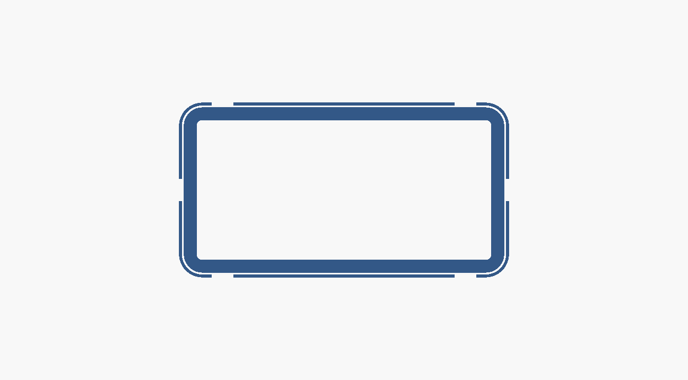
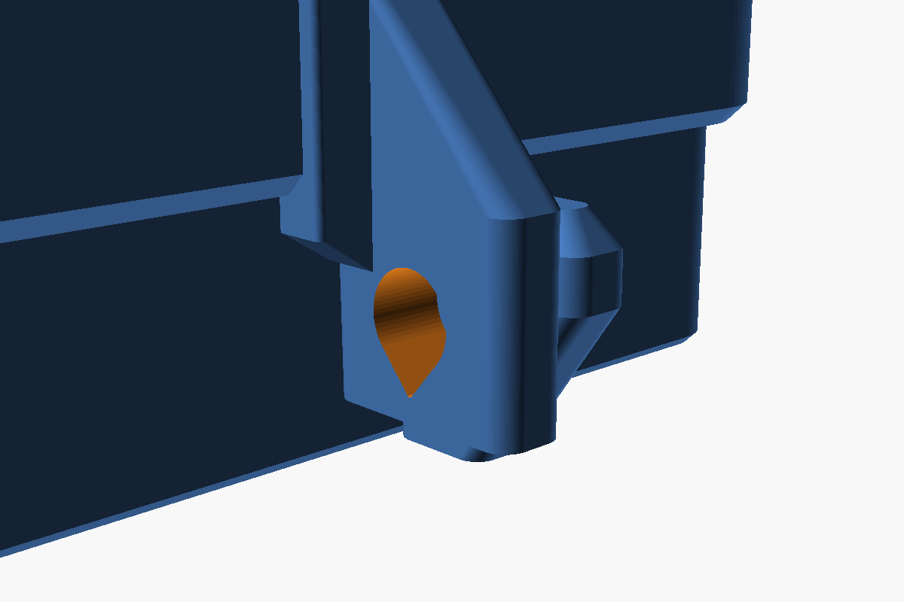

# Schlüsselsafe zur Selbstdisziplinierung (3D-Druck)

Zwei Druckteile, kein Zubehör außer einem Vorhängeschloss, **keine Stützstrukturen**,
keine Schrauben, keine Montagelöcher.


## Andere Aufgabe, anderes Design

Gegen Gelegenheitsdiebe reicht ein Kasten mit Deckel. Hier ist der „Angreifer" aber
der Besitzer selbst: mit Zeit, Werkzeug, Motivation und dem Wissen, wie die Box
gebaut ist. Dagegen hilft nicht mehr Material, sondern eine Geometrie, an der
Hebeln nichts bringt. Deshalb ist das Design komplett neu:

**1. Echte Überfalle statt Riegel durch den Deckel.**
Je eine Lasche an Kasten und Deckel stehen **nebeneinander** an der Vorderwand,
die Löcher fluchten. Der Schlossbügel liegt damit auf **Scherung** zwischen beiden
Laschen – die stabilste Art, Kunststoff zu belasten. Das Schloss hängt frei vor der
Wand, nichts liegt auf dem Deckel.

**2. Der Deckel hat keine Öffnung mehr.**
In der ersten Version ragte der Riegel durch einen Schlitz im Deckel. Jeder Schlitz
ist ein Angriffspunkt für Draht, Klinge oder Schraubendreher. Jetzt ist der Deckel
eine geschlossene Platte – der einzige Zugang ist die 0,3-mm-Fuge.

**3. Labyrinthfuge statt einfacher Auflage.**
Der Deckel greift 20 mm **außen** über den Kasten *und* 6 mm **innen** hinein. Der
Kastenrand steckt also in einer Nut. Es gibt keinen geraden Weg nach innen und der
Deckel kann nicht verkanten:


**4. Fast kein Spiel.**
Die Lochmitte sitzt nur knapp unter der Fuge, das Loch ist nur 1 mm größer als der
Bügel. Gemessen am Modell: Der Deckel lässt sich **0,8 mm** anheben, dann steht die
Deckellasche am Bügel an. Hinten hochkippen geht bis **ca. 1 mm**, dann klemmt die
Schürze am Kasten. Es entsteht also gar kein Spalt, in den ein Werkzeug passt.

**5. Langer Hebelarm für das Schloss.**
Die Verriegelung sitzt 30 mm unter der Deckeloberkante. Wer den Deckel hinten
anhebt, dreht ihn um seine Vorderkante – und muss dabei gegen die Lasche arbeiten,
nicht gegen einen Punkt direkt daneben.

**6. Keine Angriffskante.**
Die untere Schürzenkante ist angefast, alle senkrechten Kanten sind gerundet. Es
gibt keine vorstehende Lippe, unter die ein Schraubendreher greift.

| | |
|---|---|
|  |  |

## Dateien

| Datei | Inhalt |
|---|---|
| `safe_kasten.stl` / `.3mf` | Kasten, große Variante (steht bereits in Drucklage) |
| `safe_deckel.stl` / `.3mf` | Deckel, große Variante (liegt bereits auf dem Rücken) |
| `safe_kompakt_kasten.stl` | Kasten, kompakte Variante |
| `safe_kompakt_deckel.stl` | Deckel, kompakte Variante |
| `schluesselsafe.scad` | parametrisches Quellmodell beider Varianten |
| `vorschau.scad`, `vergleich.scad` | erzeugen die Bilder |

## Zwei Größen, gleiche Konstruktion

Beide Varianten stecken in derselben Datei und haben dieselbe Verriegelung,
dieselbe Labyrinthfuge und dieselben Hebelschutz-Eigenschaften. Die kompakte
braucht **halb so viel Material**.


| | `gross` | `kompakt` |
|---|---|---|
| Innenraum (B × T × H) | 80 × 45 × 68 | **80 × 38 × 32** |
| Kasten außen | 88 × 53 × 72 | 87 × 45 × 35,5 |
| Stellfläche mit Lasche | 88 × 72 | 87 × 61 |
| Deckel außen | 94,6 × 59,6 | 92,6 × 50,6 |
| Gesamthöhe geschlossen | 77 | **39,5** |
| Wand / Boden / Deckelplatte | 4 / 4 / 5 | 3,5 / 3,5 / 4 |
| Schürze außen + Lippe innen | 20 + 6 | 13 + 5 |
| Bügelloch | Ø 9, Mitte auf 40 | Ø 8, Mitte auf 13,5 |
| Materialbedarf | 152 cm³ ≈ 193 g | **76 cm³ ≈ 97 g** |
| Druckzeit gesamt | 13–18 h | **6–8 h** |

Gemessen am Modell, für beide Varianten:

| | `gross` | `kompakt` |
|---|---|---|
| Hubspiel des Deckels | 0,8 mm | 0,8 mm |
| Kippen blockiert ab | ca. 2° | ca. 2° |
| Zugfestigkeit der Deckellasche | ≈ 1,3 kN | ≈ 0,74 kN |
| Seitenlast bis Bruch (v3) | 194 N ≈ 20 kg | 163 N ≈ 17 kg |

Zug hält die Lasche reichlich aus. Die kritische Richtung ist **seitlich** —
dazu der eigene Abschnitt unten.

Der Innenraum der kompakten Variante (97 cm³) nimmt mehrere Schlüsselbunde samt
Autoschlüssel auf. Für ein Smartphone `innen_b = 170` setzen.

## Passendes Vorhängeschloss

| | `gross` | `kompakt` |
|---|---|---|
| nötige lichte Bügelweite | ≥ 18 mm | ≥ 15 mm |
| max. Bügeldurchmesser | 8 mm | 7 mm |
| passende Schlossgröße | 40 oder 50 mm | 40 mm |

Die lichte Bügelweite ist gegenüber v2 um 3 mm gestiegen (17,6 statt 15,6 bzw.
14,0 statt 11,0 mm), weil die Laschen dicker geworden sind — siehe unten. Ein
40-mm-Vorhängeschloss hat typisch 20–24 mm lichte Weite, das reicht für beide
Varianten. Wer ein kleineres Schloss hat, setzt `lasche_b` zurück; die
Seitensteifigkeit fällt dann mit dem Quadrat.

Bei der großen Variante hängt der Schlosskörper frei und endet ca. 10 mm über der
Standfläche. Bei der kompakten Variante reicht die Bauhöhe dafür nicht — das
Schloss pendelt nach unten, legt sich schräg vor die Vorderwand und stützt sich
auf der Ablage ab. Das ist normal und hebt den Kasten nicht an: Der Bügel kann
sich im Loch drehen, das Schlossgewicht geht in die Ablage.

Für den eigentlichen Zweck zählt ohnehin weniger das Schloss als die Frage, wer den
Schlüssel hat: ein Zahlenschloss mit Code, den jemand anders gesetzt hat, ein
Zeitschloss, oder schlicht der Schlüssel bei einer anderen Person. Ein Schloss, dessen
Schlüssel in der Schublade liegt, ist nur Dekoration.

## Druckempfehlung

| Einstellung | Wert |
|---|---|
| Material | **PETG** (zäh, gute Schichthaftung). PLA geht, bricht aber spröder. |
| Schichthöhe | 0,2 mm |
| Perimeter | **5** – wichtiger als Infill |
| Boden-/Deckschichten | 5 |
| Infill | 40 % |
| Stützen | **keine** (geprüft: kritische Überhangfläche 3 mm² von 40 000 mm²) |
| Orientierung | genau so laden, wie die Dateien sind |
| Druckzeit | `gross` 9–12 h + 4–6 h · `kompakt` 4–5 h + 2–3 h |

Zwei Dinge sind beim Deckel wichtig: Die Lasche steht als schmale Säule ganz oben im
Druck. Mindestschichtzeit auf ca. 10 s stellen (oder mehrere Teile gleichzeitig
drucken), sonst wird die Schichthaftung genau dort schlecht, wo die ganze Last
hängt. Und die Schichten liegen quer zur Zugrichtung – deshalb PETG, viele
Perimeter und kein heruntergedrehter Lüfter.

Rechnerisch trägt der Laschenquerschnitt über dem Bügelloch bei 26 MPa
Schichthaftung **2,7 kN** (kompakt, Deckellasche) bzw. 3,7 kN (groß) — also
rund 270 bzw. 370 kg Zug. Von Hand bekommt man das nicht auf; die kritische
Richtung ist ohnehin nicht Zug, sondern Seitenlast (siehe „Laschen — v3").

## Anpassen

Alle Maße stehen oben in `schluesselsafe.scad`:

```bash
# grosse Variante
openscad -D 'teil="kasten"' -o safe_kasten.stl schluesselsafe.scad
openscad -D 'teil="deckel"' -o safe_deckel.stl schluesselsafe.scad
# kompakte Variante
openscad -D 'variante="kompakt"' -D 'teil="kasten"' -o safe_kompakt_kasten.stl schluesselsafe.scad
openscad -D 'variante="kompakt"' -D 'teil="deckel"' -o safe_kompakt_deckel.stl schluesselsafe.scad
```

* **Andere Größe:** `innen_b`, `innen_t`, `innen_h`. Die Überfalle rückt automatisch
  mit, sie sitzt immer direkt unter der Fuge.
* **Deckel klemmt / sitzt locker:** `spiel`, `relief`, `rippe_b` — siehe unten
* **Kleineres Schloss:** `lasche_b` verkleinern (beide Laschen zusammen plus 1,6 mm
  müssen durch den Bügel passen)
* **Noch mehr Hebelschutz:** `schuerze_h = 25`, `wand = 5`
* **Doch Wandmontage:** `wandmontage = true` (Schrauben sind nur bei offenem Deckel
  erreichbar). Angeschraubt kann der Safe nicht „kurz mit in die Werkstatt".
* **Außeneinsatz:** `drainage = true`

## Passung — v3, der eigentliche Fix

**Was in v2 schiefging.** v2 hatte `spiel = 0.5` je Seite. Das Maß stimmt, und
lose eingesetzt ging der Deckel auch leicht. Aber die Schürze lag auf **2826 mm²**
parallel am Kasten an (gemessen: Kasten um 0,6 mm aufgedickt, mit dem Deckel
verschnitten, Volumen durch die Überlappung geteilt). Bei so viel Fläche genügt
eine einzige lokale Abweichung — eine nach innen gezogene lange Wand, etwas
Überextrusion, ein zu dicker Eckradius — und beim festen Zudrücken presst sich
das Ganze zusammen. Danach hält es die Reibung, und Angriffsfläche zum Abziehen
gibt es konstruktionsbedingt keine.

Mehr Spiel ist dagegen **kein** Fix. Es verschiebt nur die Schwelle, ab der es
klemmt, und kostet direkt Hebelschutz. Der Fehler ist die Fläche, nicht das Maß.

**Was v3 macht.** Die Schürzentasche ist um `relief = 0.8 mm` freigestellt —
überall außer an sechs schmalen Führungsrippen (zwei je Längswand, eine je
Schmalwand, jede 6 mm breit). Dort bleibt es bei `spiel = 0.5`. Die vier Ecken
tragen gar nicht mehr; sie sind beim Druck am unmaßgenauesten und waren genau
deshalb die erste Klemmstelle.



*Kastenwand im Schnitt, außen das freigestellte Band. Die sechs Lücken darin sind
die Führungsrippen — nur dort berührt der Deckel den Kasten.*

Dazu bekommt die Innenlippe `spiel_lippe = 1.6` statt 0,9. Sie ist reine
Labyrinthsperre und soll nie tragen; 0,9 mm reichte nicht, wenn die 87 mm lange
Kastenwand beim Drucken nach innen zieht — dann klemmte die Lippe genau am Ende
des Wegs, also erst beim vollständigen Zudrücken. Das passt exakt zum
beobachteten Fehlerbild.

Damit die Freistellung keine Steifigkeit kostet, ist die Schürzenwand um dieselben
0,8 mm dicker geworden. Sie misst in den freigestellten Zonen weiterhin 2,5 mm
(kompakt) bzw. 3,0 mm (groß), an den Rippen 3,3 bzw. 3,8 mm.

| | v2 | v3 |
|---|---|---|
| Tragende Gleitfläche, kompakt | 2826 mm² | **788 mm²** |
| davon im letzten Wegabschnitt | 2316 mm² | **322 mm²** |
| Tragende Gleitfläche, groß | 4988 mm² | **1127 mm²** |
| Spalt an den Rippen | 0,5 mm | 0,5 mm |
| Spalt dazwischen und in den Ecken | 0,5 mm | 1,3 mm |
| Spalt an der Innenlippe | 0,9 mm | 1,6 mm |
| Außenmaß Schürze, kompakt | 93,0 × 51,0 mm | 94,6 × 52,6 mm |

Die 1,3 mm in den Ecken kosten keinen Hebelschutz: die Schürze greift weiterhin
13 mm (kompakt) bzw. 20 mm (groß) über den Kasten, und hinter dem Spalt steht
massives Material. Ein Werkzeug kommt dort hinein, aber nicht weiter.

Die untersten 1,5 mm der Tasche bleiben umlaufend eng. Dieses Fangband zentriert
den Deckel beim Einfädeln und sitzt am Maul, nicht am Ende des Wegs — es kann
also nicht das Verklemmen verursachen, um das es hier geht.

Unverändert bleiben die Einführschrägen: 1,2 mm Fase an der Kastenoberkante und
ein trichterförmig aufgeweitetes Schürzenmaul.

**Neu drucken muss man nur den Deckel.** Der Kasten ist geometrisch identisch
geblieben (Volumen auf 0,000 mm³ gleich), der neue Deckel passt auf den bereits
gedruckten Kasten — geprüft: 0,0 mm³ Überschneidung im geschlossenen Zustand.

### Deckel sitzt fest und geht nicht mehr ab?

1. **Die beiden Laschen zusammendrücken.** Die Deckellasche hängt direkt neben
   der Kastenlasche und reicht deutlich tiefer. Daumen unter das untere Ende der
   Deckellasche, Finger oben auf die Kastenlasche, zusammendrücken — das ist
   genau die Abziehrichtung, mit gutem Griff und kurzem Hebel. Der einfachste
   Weg, und er verlangt kein Werkzeug.
2. Schraubendreher durch das Loch der **Deckellasche** stecken (nur so tief, dass
   er nicht in die Kastenlasche greift) und senkrecht nach oben ziehen. Dafür ist
   die Lasche ausgelegt, sie hält rund 750 N. Nicht seitlich hebeln.
3. Kasten 30 Minuten in den Kühlschrank, dann den Deckel außen kurz mit dem Föhn
   anwärmen (PLA: unter 50 °C bleiben!). Außenteil dehnt sich, Innenteil
   schrumpft — das reicht meistens.
4. Kasten festhalten, Deckel nach unten, mit der flachen Hand von oben auf den
   Kastenboden schlagen. Die Massenträgheit zieht den Deckel ab.

Nicht auf den Deckel hämmern — dabei bricht die Lasche.

**Am schon gedruckten v2-Deckel** lässt sich derselbe Effekt von Hand nachholen:
mit Schlüsselfeile oder Schleifpapier auf einem Klotz 0,3–0,4 mm aus der
Schürzeninnenseite nehmen, und zwar in den Ecken und in der Mitte der Wände —
die sechs Rippenfelder stehen lassen. Das ist v3 mit der Hand. Schneller ist es,
den neuen Deckel zu drucken.

## Laschen — v3, nach einem Bruch

**Was passiert ist.** Eine Lasche ist seitlich weggebrochen. Nachgemessen am
v2-Modell ist das kein Wunder: die Deckellasche hatte an ihren beiden kritischen
Stellen ein Widerstandsmoment von 41,8 mm³ (wo sie aus der Schürze austritt) und
16,7 mm³ (im Schnitt durch das Bügelloch). Bei Seitenlast am unteren Ende — und
genau da greift man hin, wenn man den Deckel abgenommen in die Hand nimmt —
bricht sie rechnerisch bei **54 N, also 5,5 kg**. Quer zu den Drucklagen, denn
die Deckellasche hängt in Z nach unten und wird bei Seitenlast über die
Schichtgrenzen gebogen.

Dazu kam, dass die volle Tiefe der Lasche schon bei `loch_z + 5` endete.
Zwischen dort und der Schürze war sie ein dünner, frei hängender Lappen.

**Drei Änderungen:**

1. **Volle Tiefe bis zur Fuge.** `lasche_voll_ok = fuge_z` statt `loch_z + 5`.
   Die Lasche ist jetzt bis zur Schürzenunterkante voll ausgebildet und läuft
   erst darüber aus. Der Auslaufkeil beginnt direkt an der Deckeloberkante,
   damit er unter 45 Grad bleibt.
2. **Wurzelkeil.** Beide Laschen sind im Band zwischen Wand und Bügelloch nach
   außen verbreitert (`lasche_keil`, 5 mm kompakt / 6 mm groß). Dort liegt weder
   Bügel noch Schlosskörper — der Platz ist gratis. Und dort sitzt das größte
   Biegemoment.
3. **Dicker und tiefer.** `lasche_b` 5 → 6,5 (kompakt) bzw. 7 → 8 (groß);
   `lasche_t` 16 → 19 bzw. 19 → 21. Die Dicke geht quadratisch in die
   Seitensteifigkeit ein, die Tiefe lässt neben dem Bügelloch mehr Material
   stehen.



| kompakt | v2 | v3 |
|---|---|---|
| W an der Fuge | 41,8 mm³ | **164,6 mm³** |
| W im Schnitt durchs Bügelloch | 16,7 mm³ | **50,2 mm³** |
| W an der Wurzel der Kastenlasche | 83,9 mm³ | **459,2 mm³** |
| Seitenlast am Ende bis Bruch | 54 N (5,5 kg) | **163 N (16,6 kg)** |
| nötige lichte Bügelweite | 11,0 mm | 14,0 mm |

| groß | v2 | v3 |
|---|---|---|
| W an der Fuge | 119,9 mm³ | **263,5 mm³** |
| W im Schnitt durchs Bügelloch | 46,2 mm³ | **82,3 mm³** |
| Seitenlast am Ende bis Bruch | 109 N (11,1 kg) | **194 N (19,8 kg)** |
| nötige lichte Bügelweite | 15,6 mm | 17,6 mm |

Gerechnet mit 26 MPa, also der Festigkeit **quer** zu den Drucklagen — das ist
die Richtung, in der die Lasche tatsächlich belastet wird. Längs zur Lage wären
es die üblichen 45 MPa und entsprechend höhere Werte.

**Der Wurzelkeil kostet keinen Überhang.** Geprüft in Drucklage: der Deckel hat
mit und ohne Keil dieselben 181 mm² waagerechte Fläche (das ist die Stufe der
Schürzen-Freistellung, nichts davon gehört zu den Laschen). Der Keil ist in
Drucklage am Druckbett am breitesten und verjüngt sich nach oben.

**Geprüft:** beide Teile dicht, 0,000 mm³ Durchdringung im geschlossenen
Zustand, ein Bügel Ø 7,5 (kompakt) bzw. Ø 8,0 (groß) geht kollisionsfrei durch
beide Laschen.

**Diesmal müssen beide Teile neu.** Anders als beim Passungs-Fix hat sich auch
der Kasten geändert (dickere Lasche, Wurzelkeil). Ein neuer Deckel passt nicht
mit einem alten Kasten zusammen — die Löcher fluchten nicht mehr, weil
`lasche_b` und damit `kasten_lasche_x` anders liegen.

## Was das Ding leistet – und was nicht

Es ist eine **Verzögerung, kein Tresor**, und das ist bei diesem Einsatzzweck genau
richtig: Der Impuls soll teurer werden als das, was er bringt. Aufhebeln, wackeln,
am Deckel ziehen, mit dem Schraubendreher in der Fuge stochern – das führt bei
diesem Design zu nichts, dafür ist es gebaut.

Wer mit Akkuschrauber, Säge oder Hammer rangeht, ist in zwei Minuten drin. Das lässt
sich mit gedrucktem Kunststoff nicht verhindern. Genau darin liegt aber der Trick:
Diese zwei Minuten sind laut, hinterlassen Trümmer und kosten einen neuen Druck von
über zehn Stunden. Genau diese Hürde soll der Safe sein.

Und ein praktischer Hinweis: Nichts einschließen, was in einer Notlage sofort
gebraucht wird – Autoschlüssel, wenn kein zweiter existiert, Medikamente, Ausweise.
Ein zweiter Schlüssel bei einer Vertrauensperson ist keine Schwäche des Konzepts,
sondern die Voraussetzung dafür, dass man es entspannt benutzen kann.
