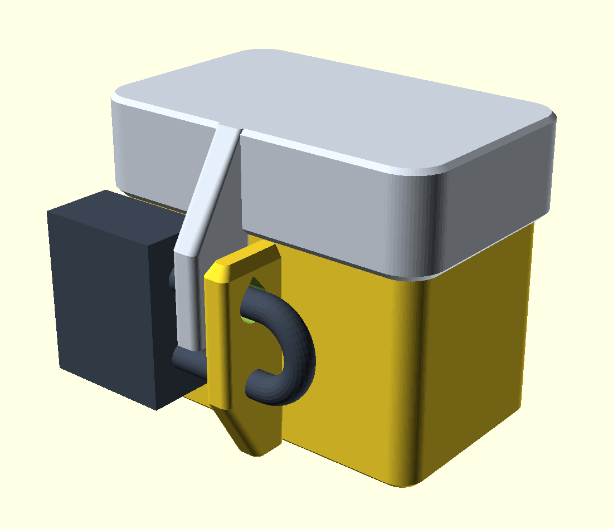
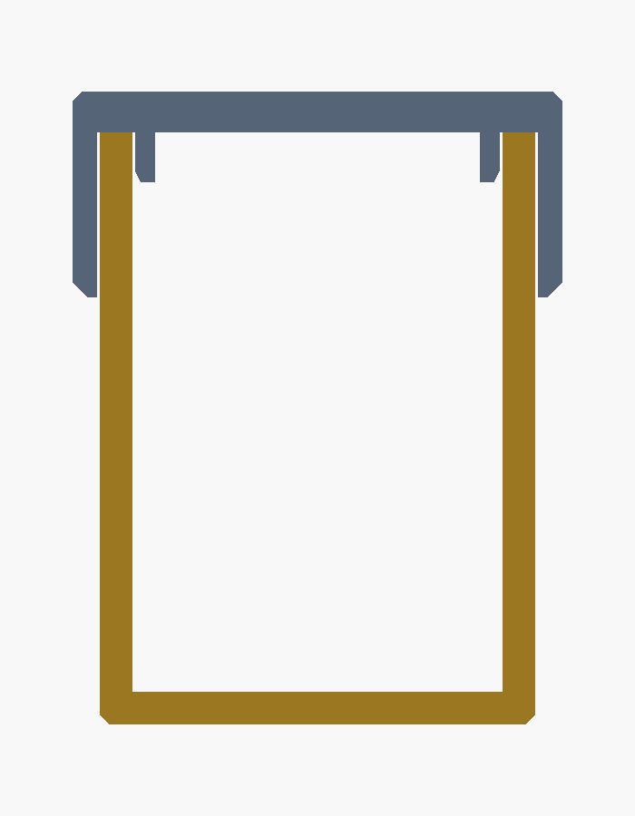
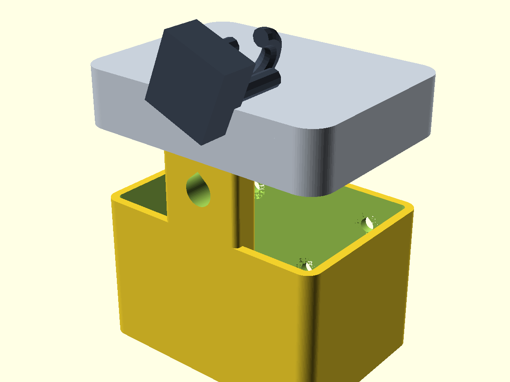
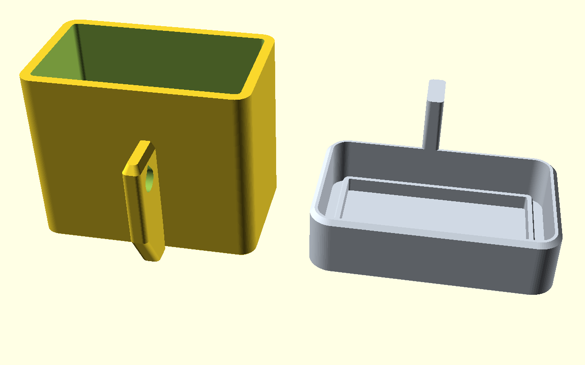
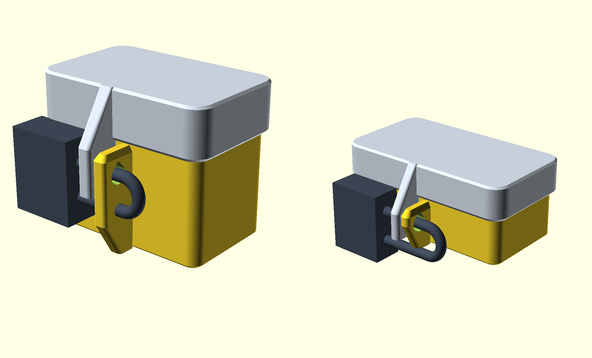

# Schlüsselsafe zur Selbstdisziplinierung (3D-Druck)

Zwei Druckteile, kein Zubehör außer einem Vorhängeschloss, **keine Stützstrukturen**,
keine Schrauben, keine Montagelöcher.



## Andere Aufgabe, anderes Design

Gegen Gelegenheitsdiebe reicht ein Kasten mit Deckel. Hier ist der „Angreifer" aber
der Besitzer selbst: mit Zeit, Werkzeug, Motivation und dem Wissen, wie die Box
gebaut ist. Dagegen hilft nicht mehr Material, sondern eine Geometrie, an der
Hebeln nichts bringt. Deshalb ist das Design komplett neu:

**1. Echte Überfalle statt Riegel durch den Deckel.**
Je eine Lasche an Kasten und Deckel stehen **nebeneinander** an der Vorderwand,
die Löcher fluchten. Der Schlossbügel liegt damit auf **Scherung** zwischen beiden
Laschen – die stabilste Art, Kunststoff zu belasten. Das Schloss hängt frei vor der
Wand, nichts liegt auf dem Deckel.

**2. Der Deckel hat keine Öffnung mehr.**
In der ersten Version ragte der Riegel durch einen Schlitz im Deckel. Jeder Schlitz
ist ein Angriffspunkt für Draht, Klinge oder Schraubendreher. Jetzt ist der Deckel
eine geschlossene Platte – der einzige Zugang ist die 0,3-mm-Fuge.

**3. Labyrinthfuge statt einfacher Auflage.**
Der Deckel greift 20 mm **außen** über den Kasten *und* 6 mm **innen** hinein. Der
Kastenrand steckt also in einer Nut. Es gibt keinen geraden Weg nach innen und der
Deckel kann nicht verkanten:



**4. Fast kein Spiel.**
Die Lochmitte sitzt nur knapp unter der Fuge, das Loch ist nur 1 mm größer als der
Bügel. Gemessen am Modell: Der Deckel lässt sich **0,8 mm** anheben, dann steht die
Deckellasche am Bügel an. Hinten hochkippen geht bis **ca. 1 mm**, dann klemmt die
Schürze am Kasten. Es entsteht also gar kein Spalt, in den ein Werkzeug passt.

**5. Langer Hebelarm für das Schloss.**
Die Verriegelung sitzt 30 mm unter der Deckeloberkante. Wer den Deckel hinten
anhebt, dreht ihn um seine Vorderkante – und muss dabei gegen die Lasche arbeiten,
nicht gegen einen Punkt direkt daneben.

**6. Keine Angriffskante.**
Die untere Schürzenkante ist angefast, alle senkrechten Kanten sind gerundet. Es
gibt keine vorstehende Lippe, unter die ein Schraubendreher greift.

| | |
|---|---|
|  |  |

## Dateien

| Datei | Inhalt |
|---|---|
| `safe_kasten.stl` / `.3mf` | Kasten, große Variante (steht bereits in Drucklage) |
| `safe_deckel.stl` / `.3mf` | Deckel, große Variante (liegt bereits auf dem Rücken) |
| `safe_kompakt_kasten.stl` | Kasten, kompakte Variante |
| `safe_kompakt_deckel.stl` | Deckel, kompakte Variante |
| `schluesselsafe.scad` | parametrisches Quellmodell beider Varianten |
| `vorschau.scad`, `vergleich.scad` | erzeugen die Bilder |

## Zwei Größen, gleiche Konstruktion

Beide Varianten stecken in derselben Datei und haben dieselbe Verriegelung,
dieselbe Labyrinthfuge und dieselben Hebelschutz-Eigenschaften. Die kompakte
braucht **halb so viel Material**.



| | `gross` | `kompakt` |
|---|---|---|
| Innenraum (B × T × H) | 80 × 45 × 68 | **80 × 38 × 32** |
| Kasten außen | 88 × 53 × 72 | 87 × 45 × 35,5 |
| Stellfläche mit Lasche | 88 × 72 | 87 × 61 |
| Deckel außen | 94,6 × 59,6 | 92,6 × 50,6 |
| Gesamthöhe geschlossen | 77 | **39,5** |
| Wand / Boden / Deckelplatte | 4 / 4 / 5 | 3,5 / 3,5 / 4 |
| Schürze außen + Lippe innen | 20 + 6 | 13 + 5 |
| Bügelloch | Ø 9, Mitte auf 40 | Ø 8, Mitte auf 13,5 |
| Materialbedarf | 146 cm³ ≈ 180 g | **72 cm³ ≈ 90 g** |
| Druckzeit gesamt | 13–18 h | **6–8 h** |

Gemessen am Modell, für beide Varianten:

| | `gross` | `kompakt` |
|---|---|---|
| Hubspiel des Deckels | 0,8 mm | 0,8 mm |
| Kippen blockiert ab | ca. 2° | ca. 2° |
| Querschnitt der Deckellasche | 67 mm² ≈ 1,3 kN | 37 mm² ≈ 0,74 kN |

Die kompakte Lasche hält rechnerisch noch rund 75 kg Zug — von Hand nicht zu
schaffen, aber eben halb so viel wie die große. Wer das nicht will, nimmt die
große Variante oder setzt `lasche_b = 6` (dann braucht das Schloss 13 mm lichte
Weite statt 11).

Der Innenraum der kompakten Variante (97 cm³) nimmt mehrere Schlüsselbunde samt
Autoschlüssel auf. Für ein Smartphone `innen_b = 170` setzen.

## Passendes Vorhängeschloss

| | `gross` | `kompakt` |
|---|---|---|
| nötige lichte Bügelweite | ≥ 17 mm | ≥ 12 mm |
| max. Bügeldurchmesser | 8 mm | 7 mm |
| passende Schlossgröße | 40 mm | 30 oder 40 mm |

Bei der großen Variante hängt der Schlosskörper frei und endet ca. 10 mm über der
Standfläche. Bei der kompakten Variante reicht die Bauhöhe dafür nicht — das
Schloss pendelt nach unten, legt sich schräg vor die Vorderwand und stützt sich
auf der Ablage ab. Das ist normal und hebt den Kasten nicht an: Der Bügel kann
sich im Loch drehen, das Schlossgewicht geht in die Ablage.

Für den eigentlichen Zweck zählt ohnehin weniger das Schloss als die Frage, wer den
Schlüssel hat: ein Zahlenschloss mit Code, den jemand anders gesetzt hat, ein
Zeitschloss, oder schlicht der Schlüssel bei einer anderen Person. Ein Schloss, dessen
Schlüssel in der Schublade liegt, ist nur Dekoration.

## Druckempfehlung

| Einstellung | Wert |
|---|---|
| Material | **PETG** (zäh, gute Schichthaftung). PLA geht, bricht aber spröder. |
| Schichthöhe | 0,2 mm |
| Perimeter | **5** – wichtiger als Infill |
| Boden-/Deckschichten | 5 |
| Infill | 40 % |
| Stützen | **keine** (geprüft: kritische Überhangfläche 3 mm² von 40 000 mm²) |
| Orientierung | genau so laden, wie die Dateien sind |
| Druckzeit | `gross` 9–12 h + 4–6 h · `kompakt` 4–5 h + 2–3 h |

Zwei Dinge sind beim Deckel wichtig: Die Lasche steht als schmale Säule ganz oben im
Druck. Mindestschichtzeit auf ca. 10 s stellen (oder mehrere Teile gleichzeitig
drucken), sonst wird die Schichthaftung genau dort schlecht, wo die ganze Last
hängt. Und die Schichten liegen quer zur Zugrichtung – deshalb PETG, viele
Perimeter und kein heruntergedrehter Lüfter.

Rechnerisch trägt der Laschenquerschnitt (67 mm² in der Lochebene) bei
konservativen 20 MPa Schichthaftung etwa **1,3 kN**, also gut 130 kg Zug. Von Hand
bekommt man das nicht auf.

## Anpassen

Alle Maße stehen oben in `schluesselsafe.scad`:

```bash
# grosse Variante
openscad -D 'teil="kasten"' -o safe_kasten.stl schluesselsafe.scad
openscad -D 'teil="deckel"' -o safe_deckel.stl schluesselsafe.scad
# kompakte Variante
openscad -D 'variante="kompakt"' -D 'teil="kasten"' -o safe_kompakt_kasten.stl schluesselsafe.scad
openscad -D 'variante="kompakt"' -D 'teil="deckel"' -o safe_kompakt_deckel.stl schluesselsafe.scad
```

* **Andere Größe:** `innen_b`, `innen_t`, `innen_h`. Die Überfalle rückt automatisch
  mit, sie sitzt immer direkt unter der Fuge.
* **Deckel klemmt / sitzt locker:** `spiel` — siehe unten
* **Kleineres Schloss:** `lasche_b` verkleinern (beide Laschen zusammen plus 1,6 mm
  müssen durch den Bügel passen)
* **Noch mehr Hebelschutz:** `schuerze_h = 25`, `wand = 5`
* **Doch Wandmontage:** `wandmontage = true` (Schrauben sind nur bei offenem Deckel
  erreichbar). Angeschraubt kann der Safe nicht „kurz mit in die Werkstatt".
* **Außeneinsatz:** `drainage = true`

## Passung — wichtig

`spiel = 0.5` (je Seite, Schürze) und `spiel_lippe = 0.9` (Innenlippe). Das ist
bewusst großzügig, weil die Fuge an **zwei** Stellen gleichzeitig greift: außen
die Schürze, innen die Lippe. Klemmt eine davon, klemmt der Deckel.

Die Innenlippe ist nur eine Labyrinthdichtung, keine Führung — sie bekommt
deshalb deutlich mehr Luft als die Schürze. Geführt wird ausschließlich über die
Schürze.

Dazu kommen Einführschrägen: 1,2 mm Fase an der Kastenoberkante und ein
trichterförmig aufgeweitetes Schürzenmaul. Der Deckel fädelt dadurch von selbst
ein, statt an der Kante zu verkanten.

**Deckel sitzt fest und geht nicht mehr ab?**

1. Schraubendreher durch das Loch der **Deckellasche** stecken (nur so tief, dass
   er nicht in die Kastenlasche greift) und senkrecht nach oben ziehen. Genau
   dafür ist die Lasche ausgelegt, sie hält rechnerisch 750 kg... nein, 750 N,
   also rund 75 kg. Nicht seitlich hebeln.
2. Kasten 30 Minuten in den Kühlschrank, dann den Deckel außen kurz mit dem Föhn
   anwärmen (PLA: unter 50 °C bleiben!). Außenteil dehnt sich, Innenteil
   schrumpft — das reicht meistens.
3. Vorn-hinten wippen statt drehen, dazu Gummihandschuhe für den Griff.
4. Kasten festhalten, Deckel nach unten, mit der flachen Hand von oben auf den
   Kastenboden schlagen. Die Massenträgheit zieht den Deckel ab.

Nicht auf den Deckel hämmern — dabei bricht die Lasche.

**Neu drucken muss man nur den Deckel.** Der neue Deckel passt auf den bereits
gedruckten Kasten (geprüft: 0,0 mm³ Überschneidung), die Einführfase am Kasten
ist eine Verbesserung, keine Bedingung.

Wer seinen Drucker gut kennt und es knapper mag, geht auf `spiel = 0.35`. Wer
einen Messschieber hat: Außenbreite des gedruckten Kastens an der Oberkante
messen, Sollwert ist 87,0 mm bei der kompakten Variante — die Differenz sagt
genau, wie viel Spiel der Drucker frisst.

## Was das Ding leistet – und was nicht

Es ist eine **Verzögerung, kein Tresor**, und das ist bei diesem Einsatzzweck genau
richtig: Der Impuls soll teurer werden als das, was er bringt. Aufhebeln, wackeln,
am Deckel ziehen, mit dem Schraubendreher in der Fuge stochern – das führt bei
diesem Design zu nichts, dafür ist es gebaut.

Wer mit Akkuschrauber, Säge oder Hammer rangeht, ist in zwei Minuten drin. Das lässt
sich mit gedrucktem Kunststoff nicht verhindern. Genau darin liegt aber der Trick:
Diese zwei Minuten sind laut, hinterlassen Trümmer und kosten einen neuen Druck von
über zehn Stunden. Genau diese Hürde soll der Safe sein.

Und ein praktischer Hinweis: Nichts einschließen, was in einer Notlage sofort
gebraucht wird – Autoschlüssel, wenn kein zweiter existiert, Medikamente, Ausweise.
Ein zweiter Schlüssel bei einer Vertrauensperson ist keine Schwäche des Konzepts,
sondern die Voraussetzung dafür, dass man es entspannt benutzen kann.
