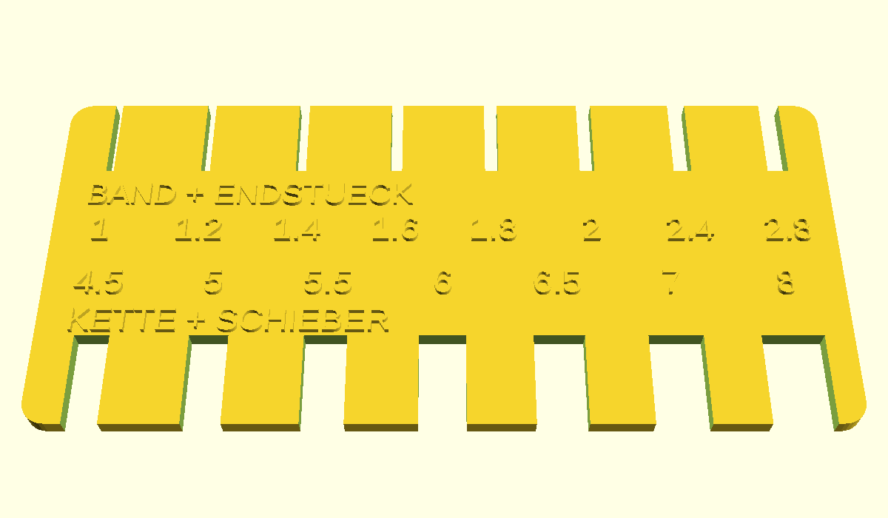
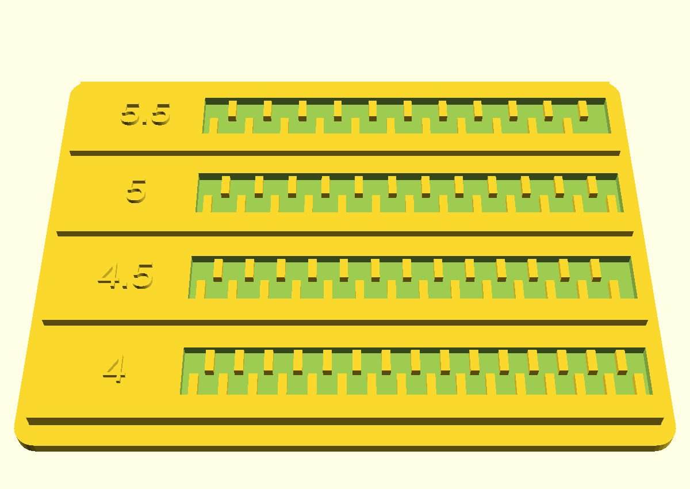

# Messlehren für die Reißverschluss-Kapsel

Zwei flache Teile, flach drucken, keine Stützen. PLA reicht völlig.
0,2 mm Schicht, 3 Perimeter, 20 % Infill.

* `messlehre_A.stl` — Schlitzlehre, 104 × 48 × 3 mm, ca. 13 g, ~15 min
* `messlehre_B.stl` — Kammlehre, 88 × 64 × 4 mm, ca. 22 g, ~25 min

## Lehre A – obere Reihe: BAND + ENDSTUECK

Das ist die wichtigste Messung. Sie legt fest, wie schmal der Schlitz oben in
der Kapsel wird – schmal genug, dass die Endstücke nicht durchrutschen, weit
genug, dass das Band nicht klemmt.

1. **Band:** Nur den Stoffstreifen direkt neben den Zähnen seitlich in die
   Schlitze einfädeln. Der kleinste Schlitz, durch den er ohne Kraft gleitet →
   **Band = ?**
2. **Endstück:** Band einfädeln und dann längs schieben, bis das Klötzchen über
   dem Schieber anstößt. Der größte Schlitz, in dem es hängen bleibt →
   **Stopp = ?**
3. Falls dein Reißverschluss oben gar kein Endstück hat (manchmal ist es unter
   der Kragennaht versteckt): sag Bescheid, dann trägt der Kamm allein.

## Lehre A – untere Reihe: KETTE + SCHIEBER

4. **Kettenbreite:** geschlossene Zahnkette flach in die Schlitze → kleinster,
   in den sie ohne Zwang passt.
5. **Kettendicke:** dieselbe Kette hochkant gedreht → kleinster passender Schlitz.
6. **Schieberdicke:** Schieber hochkant → kleinster passender Schlitz. Passt er
   in keinen (über 8 mm), einfach mit dem Lineal messen.

## Lehre B – TEILUNG

Vier Rinnen mit Kämmen in 4,0 / 4,5 / 5,0 / 5,5 mm Teilung. Die Stege sitzen
wechselseitig, genau wie später in der Kapsel.

7. Die geschlossene Kette nacheinander in jede Rinne drücken. Gesucht ist die,
   bei der die Kette **über die ganze Länge** einrastet und flach liegt. Bei
   falscher Teilung läuft der Kamm weg: vorn passt es, hinten steht die Kette hoch.
8. Notiere die Zahl – und falls keine passt, welche am weitesten trägt, bevor
   sie wegdriftet.

## Zusätzlich, Lineal genügt (±0,5 mm)

* Schieberkörper: Länge × Breite (ohne Griffplättchen)
* Griffplättchen: Länge × Breite
* **Abstand Kettenmitte → Naht**, mit der das Band am Overall angenäht ist, und
  wie dick der Stoff dort aufträgt. Sonst sitzt die Kapsel auf der Naht auf
  statt auf dem Band.
* Vorhängeschloss: Bügeldurchmesser und Länge des geraden Schenkels (er muss
  durch beide Ohren, also ca. 20 mm).
* Reißverschluss vorn oder hinten? Hinten baue ich flacher.

## Wenn du einen Messschieber hast

Miss einmal nach, wie breit der Schlitz „2" bei dir tatsächlich geworden ist.
Damit rechne ich den Versatz deines Druckers heraus, und die Kapsel passt auf
Anhieb statt erst im zweiten Anlauf.
