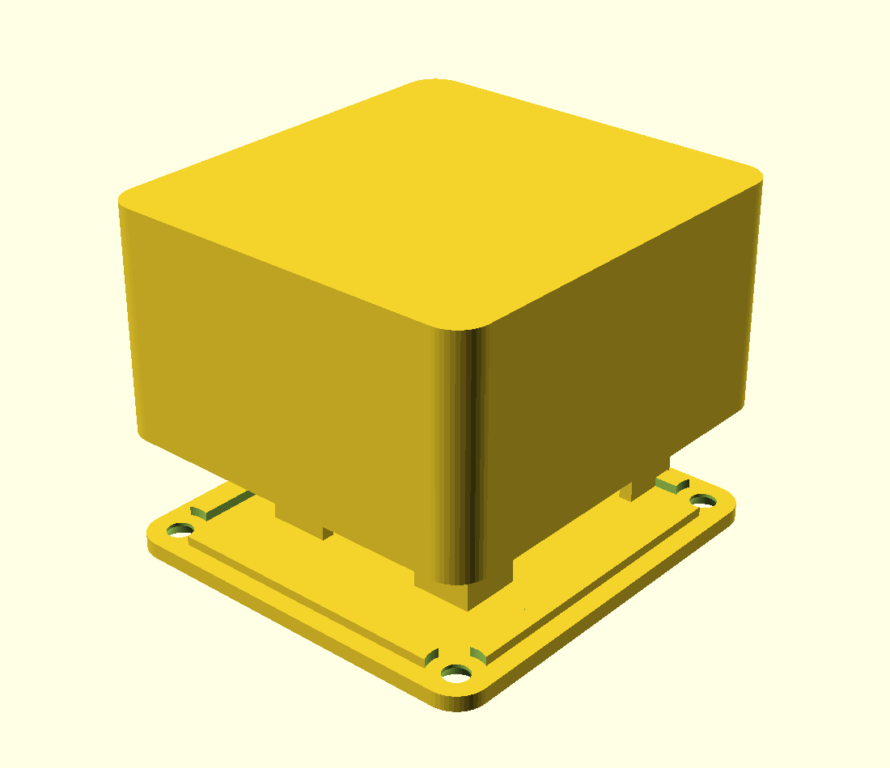
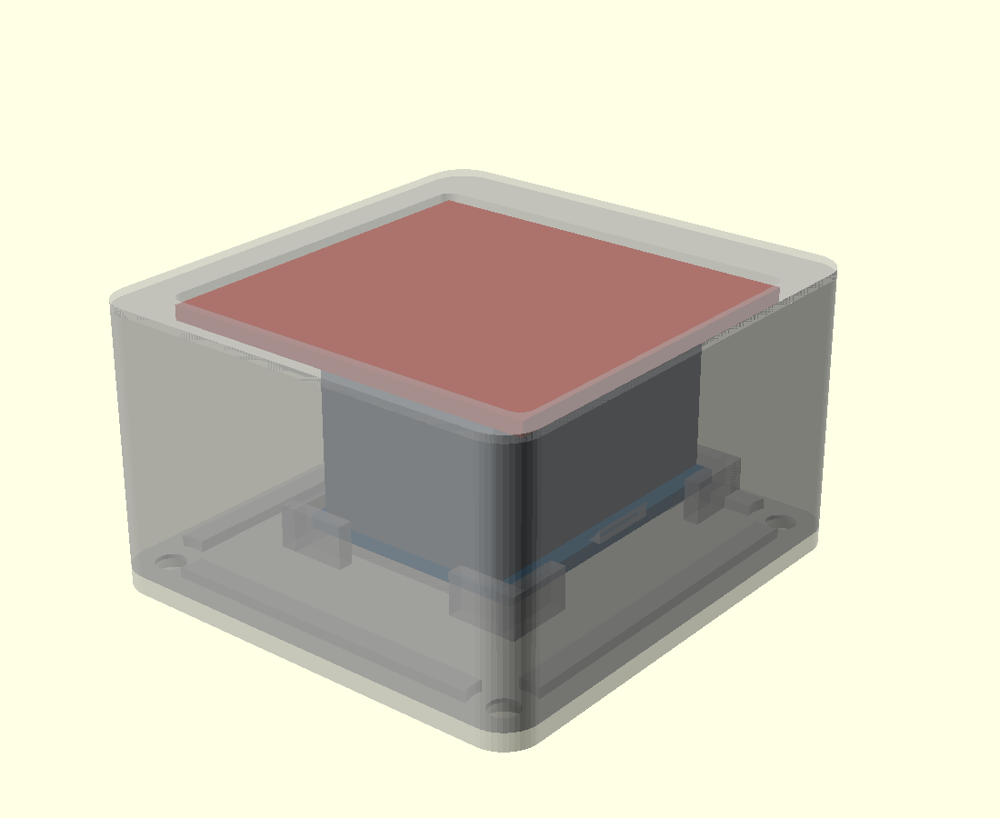

# Gehäuse für NFC-Reader (ESP32 D1 Mini + PN532)

Zweiteilig, vier Schrauben, beide Teile drucken flach **ohne Stützen**.

 

## Aufbau

Das PN532 sitzt in einer **Einlassung direkt unter der Deckfläche** — die
Antennenseite liegt flach an der 1,6 mm dünnen Wand an, das ist die Lesefläche.
Zwei Rastnasen halten die Platine, sie wird von unten eingeschoben und klickt ein.

Darunter bleiben **18,5 mm freie Höhe** für die aufgesteckten Dupont-Stecker des
ESP32. Der ESP32 selbst liegt auf der Bodenplatte in vier Eckwinkeln mit zwei
Auflageleisten, der USB-Anschluss zeigt durch den Ausschnitt in der Rückwand.

Die hängenden Buchsen des PN532 haben vorn einen 9 mm breiten Freiraum, weil der
ESP32 nach hinten versetzt sitzt — die Kabel laufen also diagonal durch den
Innenraum, ohne geknickt zu werden.

## Die Bauhöhe hängt an der Verkabelung

| | `verkabelung = "dupont"` | `verkabelung = "geloetet"` |
|---|---|---|
| Außenmaße | 51,4 × 54,4 × **39,3** mm | 51,4 × 54,4 × **17,8** mm |
| Material | 28 cm³ ≈ 35 g | 19 cm³ ≈ 23 g |
| Druckzeit | ca. 3,5 h | ca. 2 h |

Der Unterschied kommt allein von den Dupont-Steckern:

```
Buchsenleiste auf dem D1 Mini      8,5 mm
Steckerkörper sitzt obenauf       14,0 mm
Kabelbogen                         3,0 mm
                                  -------
über der ESP-Platine              25,5 mm
```

Das ist der Boden, unter den man mit aufgesteckten Dupont-Kabeln nicht kommt —
unabhängig davon, wie man die Platinen anordnet. Vier gelötete Drähte statt der
Stecker machen aus 39 mm gute 18 mm.

Umschalten:

```bash
openscad -D 'verkabelung="geloetet"' -D 'teil="schale"' -o schale.stl nfc_gehaeuse.scad
```

Ein gestuftes Gehäuse (flache Lesefläche vorn, hohes Heck hinten) habe ich
gebaut und wieder verworfen: Es lässt sich nicht stützenfrei drucken. Liegt das
Heck auf dem Bett, schwebt die Pad-Decke frei — gemessen 2762 mm² Überhang.

| | |
|---|---|
| Wandstärke | 2,2 mm, über der Antenne 1,6 mm |
| Verschluss | vier Schnapparme, kein Werkzeug |
| Aufhängung | Öse Ø 8,5 mm an der linken Wand |

## Vor dem Druck nachmessen

Die Modulmaße sind **Annahmen**. Drei Werte entscheiden, ob es passt — sie stehen
oben in `nfc_gehaeuse.scad`:

| Parameter | Annahme | was messen |
|---|---|---|
| `pn_b`, `pn_t` | 43 × 41 mm | Platinenkanten des PN532 |
| `esp_b`, `esp_t` | 26 × 34,5 mm | Platinenkanten des D1 Mini |
| `esp_oben` | 17 mm | **der kritische Wert:** Höhe von der Platinenoberseite bis zur Oberkante der aufgesteckten Dupont-Stecker, inklusive Kabelbogen |

`esp_oben` bestimmt die Bauhöhe. Steckst du die Kabel auf und misst vom Board bis
zur höchsten Stelle, hast du den Wert. Das Modell rechnet die Gehäusehöhe daraus
aus und **bricht mit einer Fehlermeldung ab**, wenn etwas nicht mehr passt — es
kommt also kein Gehäuse heraus, in das die Elektronik nicht hineingeht.

```bash
openscad -D 'esp_oben=20' -D 'teil="schale"' -o nfc_schale.stl nfc_gehaeuse.scad
openscad -D 'teil="boden"' -o nfc_boden.stl nfc_gehaeuse.scad
```

## Druck

| Einstellung | Wert |
|---|---|
| Material | PLA oder PETG, **kein** Carbon- oder Metallic-Filament |
| Schichthöhe | 0,2 mm |
| Perimeter | 3 |
| Infill | 20 % |
| Stützen | keine |
| Lage | so wie die STLs geladen werden: Schale mit der Lesefläche aufs Bett, Boden flach |

Die Schale liegt mit der NFC-Fläche auf dem Druckbett — die wird dadurch glatt
und bleibt exakt 1,6 mm dünn. **Diese Wand nicht dicker machen**, jeder
zusätzliche Millimeter kostet Lesereichweite.

Metallhaltiges Filament (Carbon, „Silk Metallic", Glitter) dämpft das Feld und
kann den Reader unbrauchbar machen. Normales PLA ist völlig unkritisch.

## Einbau

1. **DIP-Schalter am PN532 zuerst setzen** — sie zeigen nach dem Einbau nach
   innen und sind dann nicht mehr erreichbar. I2C heißt: Schalter 1 auf ON,
   Schalter 2 auf OFF.
2. Kabel aufstecken, Funktion testen (siehe unten), erst dann einbauen.
3. PN532 von unten in die Einlassung drücken, bis es hinter den beiden Rastnasen
   einrastet. Antennenseite (die flache) zeigt zur Deckfläche.
4. ESP32 in die Eckwinkel auf der Bodenplatte legen, USB-Buchse Richtung
   Ausschnitt.
5. Kabel in einem weiten Bogen legen, nicht knicken.
6. Bodenplatte von unten eindrücken, bis die vier Schnapper hörbar einrasten.

Zum Öffnen: die vier Nasen sind durch die Fenster in den Seitenwänden sichtbar.
Mit dem Fingernagel oder einem flachen Schraubendreher nach innen drücken, dann
löst sich die Platte.

**Zur Schraubenfrage:** Gewinde müssen nie gedruckt werden. Blechschrauben
schneiden sich ihr Gewinde selbst in ein glattes Loch von etwa 0,6 mm unter
Nenndurchmesser — das ist der Normalfall bei gedruckten Gehäusen und hält
erstaunlich gut. Hier sind trotzdem Schnapper verbaut, weil das Gehäuse leicht
ist und nie unter Last steht.

Wenn das PN532 in der Einlassung wackelt: ein Tropfen Heißkleber an einer Ecke.
Nicht die ganze Platine verkleben, sonst kommst du nie wieder ran.

---

# Anmerkungen zur Anleitung

Das meiste stimmt: Die DIP-Schalter für I2C sind richtig (1 = ON, 2 = OFF), die
I2C-Adresse `0x24` ist korrekt, `wemos_d1_mini32` ist das richtige Board, und
GPIO21/22 sind die Standard-I2C-Pins des ESP32. Drei Dinge würde ich ändern.

## 1. Ohne `api:` findet Home Assistant das Gerät nie

Das ist der wichtigste Punkt. Schritt 6 der Anleitung („wird automatisch als
Integration vorgeschlagen") passiert nur, wenn die API-Komponente aktiv ist. In
der gezeigten YAML fehlt sie — das Gerät wäre im WLAN, würde aber in Home
Assistant nicht auftauchen.

Ebenfalls fehlt `ota:`. Ohne den Block lässt sich später nur noch per Kabel
flashen, und das Gehäuse ist dann schon zu.

## 2. Das Lambda braucht ein `return`

`!lambda 'x'` ist kein gültiger Ausdruck. Richtig ist `!lambda 'return x;'`.

## 3. Korrigierte Konfiguration

```yaml
esphome:
  name: nfc-reader
  friendly_name: NFC Reader

esp32:
  board: wemos_d1_mini32
  framework:
    type: arduino

wifi:
  ssid: !secret wifi_ssid
  password: !secret wifi_password

logger:

api:                      # ohne diesen Block: keine Verbindung zu Home Assistant
  encryption:
    key: !secret api_key   # optional, aber empfohlen

ota:                      # sonst sind spätere Updates nur per Kabel möglich
  - platform: esphome

i2c:
  sda: GPIO21
  scl: GPIO22
  scan: true              # zeigt beim Start im Log, ob 0x24 antwortet

pn532_i2c:
  address: 0x24
  update_interval: 1s
  on_tag:
    then:
      - homeassistant.tag_scanned: !lambda 'return x;'
```

Die Listen-Schreibweise bei `ota:` gilt für ESPHome ab 2024.6. Bei älteren
Versionen ist `ota:` ein einfacher Block ohne `- platform:`.

## Kleinigkeiten

**3,3 V oder 5 V?** Die Warnung „Nicht an 5V!" ist zu streng. Das rote V3-Board
hat einen eigenen 3,3-V-Regler und ist für 3,3–5 V ausgelegt. 3,3 V funktioniert
und ist sicher — falls die Lesereichweite mager ausfällt, ist 5 V an VCC einen
Versuch wert (die I2C-Leitungen bleiben in beiden Fällen auf 3,3-V-Logik, der
ESP32 verträgt nichts anderes).

**Welcher D1 Mini?** GPIO21/22 gibt es nur auf dem ESP32. Der klassische Wemos
D1 Mini ist ein ESP8266 — dort wären es `D2`/`D1` (GPIO4/GPIO5) und
`esp8266: board: d1_mini` statt des `esp32:`-Blocks. Im Zweifel: ESP8266-Boards
tragen ein Blechkästchen mit der Aufschrift ESP-12F.

**Erst testen, dann einbauen** — das steht in der Anleitung und ist genau
richtig. `scan: true` im Log zeigt dir sofort, ob die Verkabelung sitzt:
erscheint `Found i2c device at address 0x24`, stimmt alles.


## Aufhängeöse

An der linken Seitenwand sitzt eine Öse mit 8,5 mm Bohrung — passt für einen
Vorhängeschlossbügel bis 7,5 mm, einen Karabiner oder eine Schnur. Sie steht
16,5 mm über die Wand hinaus, das Gehäuse wird damit 67,9 mm breit.

Die Öse hängt an der **Schale**, nicht an der Bodenplatte. Beim Tragen zieht die
Last also nicht an den Schnappern. Der tragende Querschnitt über dem Loch misst
(am Modell nachgemessen) 87 mm² — bei 20 MPa zulässiger Zugspannung im PETG
entspricht das rund 1700 N. Für ein 60-Gramm-Gehäuse ist das weit jenseits
dessen, was je anliegt.

Das Loch ist als Tropfen ausgeführt, damit es in Drucklage ohne Stütze bleibt.

**Ein Hinweis zum Vorhängeschloss:** Metall in der Nähe der Antenne kostet
Lesereichweite. Die Öse sitzt deshalb 13 mm unterhalb der Antennenebene und auf
der Seite. Ein Bügelschloss direkt daran wird die Reichweite trotzdem etwas
drücken — eine Schnur oder ein Kunststoffkarabiner ist unkritisch. Zum
Abschließen an einem festen Punkt ist das egal, dann hängt das Schloss ohnehin
an der Befestigung und nicht am Gehäuse.

Öse nicht gewünscht: `-D oese_an=false`.

### Zwei Ösen fürs Nackenband

`-D oese_seiten=2` spiegelt die Öse auf die rechte Wand. Das Gehäuse wird damit
84,4 mm breit. Mit einer Schnur durch beide Ösen hängt der Reader **flach an der
Brust**, das NFC-Fenster nach oben — der Tag wird von oben aufgelegt. Mit nur
einer Öse kippt die Box am Band weg und dreht sich.

    openscad -o nfc_schale_band.stl -D 'teil="schale"' -D oese_seiten=2 nfc_gehaeuse.scad

Geprüft: 0 offene Kanten, echter Überhang 486 mm² (vorher 326), die Zunahme sind
allein die Tangentialflächen am Augenkreis — dieselbe Geometrie wie bei der
ersten Öse.

Zwei Hinweise fürs Tragen:

* **Sicherheitsverschluss ans Band.** Ein starres Gehäuse mit Powerbank kommt
  auf 150–200 g. Ein Lanyard mit Breakaway-Clip ist hier kein Zubehör, sondern
  Pflicht.
* **USB-Winkelkabel.** Die Buchse sitzt in der Seitenwand und zeigt am Band
  waagerecht nach vorn oder hinten. Ein gerades Kabel knickt direkt am Stecker
  ab; ein 90°-USB-C-Kabel führt sauber nach unten Richtung Tasche.

## Powerbank am Hals — drei Wege

## Stromversorgung — muss das Kabel dranbleiben?

Ja. Der ESP32 mit aktivem WLAN und das PN532 im Dauerscan ziehen zusammen grob
**120–180 mA bei 5 V**. Deep Sleep hilft nicht, denn der Reader soll ja
durchgehend auf Karten lauschen.

| Option | Laufzeit | Aufwand |
|---|---|---|
| **Powerbank am USB** | 5000 mAh ≈ 20 h | keiner |
| LiPo + TP4056 + Step-Up | 2000 mAh ≈ 9 h | löten, und lohnt kaum |
| Taster + Deep Sleep | Wochen | ESPHome-Umbau, 3–5 s Wartezeit pro Scan |

Die Powerbank ist der pragmatische Weg. Ein Detail: Viele Powerbanks schalten
unter etwa 50–100 mA ab, weil sie denken, es hängt nichts dran. Hier fließen
150 mA, das hält die meisten wach — ausprobieren.

`power_save_mode: HIGH` im `wifi:`-Block spart nochmal 30–40 mA, kostet dafür
etwas Reaktionszeit beim ersten Scan nach einer Pause.

**Der größere Haken beim Herumtragen:** Das Gerät funktioniert nur in
WLAN-Reichweite. ESPHome puffert Tag-Scans nicht — außerhalb des Netzes wird
einfach nichts gemeldet, und der Scan ist verloren. Im Haus herumtragen geht,
unterwegs nicht. Wenn es wirklich offline mitlaufen soll, wäre das ein anderes
Gerät: Tags lokal zwischenspeichern und beim nächsten WLAN-Kontakt nachreichen —
das kann ESPHome nicht, dafür müsste man auf Arduino oder ESP-IDF wechseln.

### 1. Powerbank in der Tasche (empfohlen)

Flache Karten-Powerbank (5000 mAh, ca. 95 × 65 × 10 mm, 110 g) in Hemd- oder
Hosentasche, 50 cm Winkelkabel am Band entlang nach oben. Am Hals hängen dann
nur die 80 g Gehäuse. Läuft rund 20 Stunden. Kein Umbau nötig.

### 2. Powerbank als Gegengewicht im Nacken

Stick-Powerbank (2500 mAh, Ø 22 × 90 mm, ca. 60 g) in einer kleinen Tasche
hinten am Nackenband, Kabel innen am Band nach vorn. Das ist der Aufbau, den
Tourguide-Sender benutzen: das Gewicht balanciert den Reader vorn aus, statt
sich dazuzuaddieren. Laufzeit ca. 10 Stunden.

### 3. Akku unter dem Boden (Umbau)

Die Bodenplatte gegen eine 14 mm tiefe Akkuwanne tauschen: 103450-LiPo
(10 × 34 × 50 mm, 2000 mAh), TP4056-Lademodul mit USB-C, Schiebeschalter in der
Seitenwand. Der Innenraum der Schale bleibt unangetastet, die Schnappverbindung
auch. Ergibt ein Gerät ohne Kabel, ca. 140 g, Laufzeit 8–11 Stunden. Ist noch
nicht gebaut — sag Bescheid, wenn du das willst.

Rechnung zu 3: 2000 mAh × 3,7 V = 7,4 Wh, Boost auf 5 V mit 85 % → 6,3 Wh.
Bei 150 mA sind das 8,4 h, mit `power_save_mode: HIGH` bei ~110 mA knapp 11 h.
Ein Arbeitstag, nicht mehr.

**Gilt für alle drei:** Der Reader meldet nur innerhalb deines WLANs. ESPHome
puffert Scans nicht — außerhalb der Reichweite passiert schlicht nichts.
