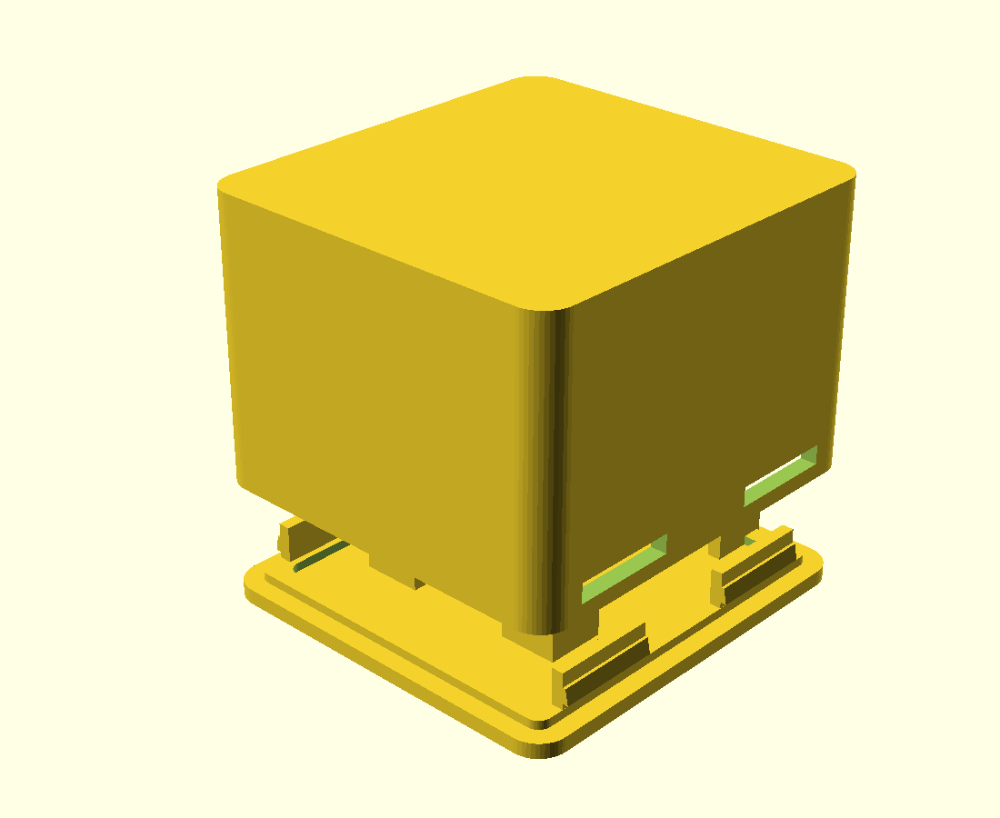

# Gehäuse für NFC-Reader (ESP32 D1 Mini + PN532)

Zweiteilig, vier Schrauben, beide Teile drucken flach **ohne Stützen**.

 

## Aufbau

Das PN532 sitzt in einer **Einlassung direkt unter der Deckfläche** — die
Antennenseite liegt flach an der 1,6 mm dünnen Wand an, das ist die Lesefläche.
Zwei Rastnasen halten die Platine, sie wird von unten eingeschoben und klickt ein.

Darunter bleiben **18,5 mm freie Höhe** für die aufgesteckten Dupont-Stecker des
ESP32. Der ESP32 selbst liegt auf der Bodenplatte in vier Eckwinkeln mit zwei
Auflageleisten, der USB-Anschluss zeigt durch den Ausschnitt in der Rückwand.

Die hängenden Buchsen des PN532 haben vorn einen 9 mm breiten Freiraum, weil der
ESP32 nach hinten versetzt sitzt — die Kabel laufen also diagonal durch den
Innenraum, ohne geknickt zu werden.

## Die Bauhöhe hängt an der Verkabelung

| | `verkabelung = "dupont"` | `verkabelung = "geloetet"` |
|---|---|---|
| Außenmaße | 51,4 × 54,4 × **39,3** mm | 51,4 × 54,4 × **17,8** mm |
| Material | 28 cm³ ≈ 35 g | 19 cm³ ≈ 23 g |
| Druckzeit | ca. 3,5 h | ca. 2 h |

Der Unterschied kommt allein von den Dupont-Steckern:

```
Buchsenleiste auf dem D1 Mini      8,5 mm
Steckerkörper sitzt obenauf       14,0 mm
Kabelbogen                         3,0 mm
                                  -------
über der ESP-Platine              25,5 mm
```

Das ist der Boden, unter den man mit aufgesteckten Dupont-Kabeln nicht kommt —
unabhängig davon, wie man die Platinen anordnet. Vier gelötete Drähte statt der
Stecker machen aus 39 mm gute 18 mm.

Umschalten:

```bash
openscad -D 'verkabelung="geloetet"' -D 'teil="schale"' -o schale.stl nfc_gehaeuse.scad
```

Ein gestuftes Gehäuse (flache Lesefläche vorn, hohes Heck hinten) habe ich
gebaut und wieder verworfen: Es lässt sich nicht stützenfrei drucken. Liegt das
Heck auf dem Bett, schwebt die Pad-Decke frei — gemessen 2762 mm² Überhang.

| | |
|---|---|
| Wandstärke | 2,2 mm, über der Antenne 1,6 mm |
| Verschluss | vier Schnapparme, kein Werkzeug |
| Aufhängung | Öse Ø 8,5 mm an der linken Wand, stützenfrei, 20 mm breit angebunden |

## Vor dem Druck nachmessen

Die Modulmaße sind **Annahmen**. Drei Werte entscheiden, ob es passt — sie stehen
oben in `nfc_gehaeuse.scad`:

| Parameter | Annahme | was messen |
|---|---|---|
| `pn_b`, `pn_t` | 43 × 41 mm | Platinenkanten des PN532 |
| `esp_b`, `esp_t` | 26 × 34,5 mm | Platinenkanten des D1 Mini |
| `esp_oben` | 17 mm | **der kritische Wert:** Höhe von der Platinenoberseite bis zur Oberkante der aufgesteckten Dupont-Stecker, inklusive Kabelbogen |

`esp_oben` bestimmt die Bauhöhe. Steckst du die Kabel auf und misst vom Board bis
zur höchsten Stelle, hast du den Wert. Das Modell rechnet die Gehäusehöhe daraus
aus und **bricht mit einer Fehlermeldung ab**, wenn etwas nicht mehr passt — es
kommt also kein Gehäuse heraus, in das die Elektronik nicht hineingeht.

```bash
openscad -D 'esp_oben=20' -D 'teil="schale"' -o nfc_schale.stl nfc_gehaeuse.scad
openscad -D 'teil="boden"' -o nfc_boden.stl nfc_gehaeuse.scad
```

## Druck

| Einstellung | Wert |
|---|---|
| Material | PLA oder PETG, **kein** Carbon- oder Metallic-Filament |
| Schichthöhe | 0,2 mm |
| Perimeter | 3 |
| Infill | 20 % |
| Stützen | keine |
| Lage | so wie die STLs geladen werden: Schale mit der Lesefläche aufs Bett, Boden flach |

Die Schale liegt mit der NFC-Fläche auf dem Druckbett — die wird dadurch glatt
und bleibt exakt 1,6 mm dünn. **Diese Wand nicht dicker machen**, jeder
zusätzliche Millimeter kostet Lesereichweite.

Metallhaltiges Filament (Carbon, „Silk Metallic", Glitter) dämpft das Feld und
kann den Reader unbrauchbar machen. Normales PLA ist völlig unkritisch.

## Drei Ausbaustufen — Home Assistant ist optional

Der Reader braucht keinen Server. Was du an Infrastruktur aufbaust, entscheidet
nur, **was mit dem gelesenen Tag passiert**.

| | was du brauchst | was es kann |
|---|---|---|
| **1 — `esphome/01-nur-testen.yaml`** | nur ESPHome auf deinem PC, USB-Kabel | Tag-Nummer erscheint im Log. Beweist, dass Hardware und Verkabelung stimmen. |
| **2 — `esphome/02-ohne-server.yaml`** | dasselbe | Der ESP entscheidet selbst: bekannte Tags schalten einen Ausgang. Läuft ohne WLAN, ohne Server, an der Powerbank. |
| **3 — `esphome/03-home-assistant.yaml`** | ein dauerhaft laufendes Home Assistant + WLAN | Jeder Scan wird HA gemeldet, Automatisierungen über alle Geräte, Historie, Dashboard. |

Stufe 1 ist immer der erste Schritt. Stufe 2 ist für viele Anwendungen schon das
Ziel. Stufe 3 lohnt erst, wenn du mehrere Geräte zusammenspielen lassen willst.

**Wichtig für Stufe 3:** ESPHome puffert Scans nicht. Außerhalb der
WLAN-Reichweite passiert nichts, und der Scan ist verloren. Stufe 2 hat dieses
Problem nicht — dort steckt die Logik im Gerät.

## Verdrahtung

Vier Leitungen, mehr braucht der I2C-Betrieb nicht. `IRQ` und `RSTO` am PN532
bleiben frei — ESPHome pollt.

| PN532 (rotes V3-Board) | ESP32 D1 Mini | Anmerkung |
|---|---|---|
| VCC | `3V3` | 5 V geht auch, das Board hat einen eigenen Regler |
| GND | `GND` | |
| SDA | `GPIO21` | |
| SCL | `GPIO22` | |

**Vorher die DIP-Schalter setzen:** 1 auf ON, 2 auf OFF. Nach dem Einbau zeigen
sie nach innen und sind nicht mehr erreichbar.

Reihenfolge, die Ärger spart:

1. DIP-Schalter setzen, vier Leitungen stecken, **noch nichts einbauen**.
2. Flashen (USB, `esphome run nfc-reader.yaml`).
3. Log ansehen. `Found i2c device at address 0x24` heißt: Verkabelung stimmt.
   Kommt stattdessen nichts oder `0x48`, sind SDA/SCL vertauscht oder die
   DIP-Schalter stehen falsch.
4. Tag auflegen. Im Log erscheint `Found new tag '...'`.
5. Erst jetzt einbauen.

## Passprüfung — passt die gedruckte Schale?

Die Modulmaße im Modell sind Annahmen. Am gedruckten Teil nachmessen, Sollwerte:

| Stelle | Soll (Schieblehre) | Platz für |
|---|---|---|
| PN532-Einlassung | 43,8 × 41,8 mm, 5,1 mm tief | Platine 43 × 41, Bauteile 3,5 mm |
| Innenraum | 47,0 × 50,0 mm | |
| freie Höhe über der ESP-Platine | **27,0 mm** | Dupont-Stapel 25,5 mm |
| USB-Ausschnitt | 13 × 7 mm, Unterkante 3,1 mm über dem Innenboden | |

**Der kritische Wert ist die freie Höhe.** Zwischen dem angenommenen
Dupont-Stapel (25,5 mm) und dem verfügbaren Platz (27,0 mm) liegen nur
**1,5 mm Reserve**. Miss deinen echten Stapel: Kabel aufstecken, von der
Platinenoberseite bis zur höchsten Stelle inklusive Kabelbogen. Über 27 mm
schließt die Bodenplatte nicht.

Probe ohne Werkzeug, in dieser Reihenfolge:

1. PN532 von innen in die Einlassung drücken — muss hinter beiden Rastnasen
   einrasten und darf nicht wackeln.
2. ESP32 in die Eckwinkel der Bodenplatte legen, USB-Buchse zum Ausschnitt.
3. Bodenplatte **ohne** gesteckte Kabel aufsetzen: rasten alle vier Schnapper
   hörbar ein?
4. Kabel stecken, Bogen weit legen, Bodenplatte erneut aufsetzen. Wenn sie jetzt
   nicht mehr schließt oder sich wölbt, ist der Dupont-Stapel zu hoch.

Wenn die Höhe nicht reicht — Schale neu drucken mit dem gemessenen Wert, das
Modell rechnet alles andere nach:

```bash
openscad -D 'esp_oben=28' -D 'teil="schale"' -o nfc_schale.stl nfc_gehaeuse.scad
```

Die Bodenplatte bleibt in jedem Fall unverändert, die muss nicht neu.

## Einbau

1. **DIP-Schalter am PN532 zuerst setzen** — sie zeigen nach dem Einbau nach
   innen und sind dann nicht mehr erreichbar. I2C heißt: Schalter 1 auf ON,
   Schalter 2 auf OFF.
2. Kabel aufstecken, Funktion testen (siehe unten), erst dann einbauen.
3. PN532 von unten in die Einlassung drücken, bis es hinter den beiden Rastnasen
   einrastet. Antennenseite (die flache) zeigt zur Deckfläche.
4. ESP32 in die Eckwinkel auf der Bodenplatte legen, USB-Buchse Richtung
   Ausschnitt.
5. Kabel in einem weiten Bogen legen, nicht knicken.
6. Bodenplatte von unten eindrücken, bis die vier Schnapper hörbar einrasten.

Zum Öffnen: die vier Nasen sind durch die Fenster in den Seitenwänden sichtbar.
Mit dem Fingernagel oder einem flachen Schraubendreher nach innen drücken, dann
löst sich die Platte.

**Zur Schraubenfrage:** Gewinde müssen nie gedruckt werden. Blechschrauben
schneiden sich ihr Gewinde selbst in ein glattes Loch von etwa 0,6 mm unter
Nenndurchmesser — das ist der Normalfall bei gedruckten Gehäusen und hält
erstaunlich gut. Hier sind trotzdem Schnapper verbaut, weil das Gehäuse leicht
ist und nie unter Last steht.

Wenn das PN532 in der Einlassung wackelt: ein Tropfen Heißkleber an einer Ecke.
Nicht die ganze Platine verkleben, sonst kommst du nie wieder ran.

---

# Anmerkungen zur Anleitung

Das meiste stimmt: Die DIP-Schalter für I2C sind richtig (1 = ON, 2 = OFF), die
I2C-Adresse `0x24` ist korrekt, `wemos_d1_mini32` ist das richtige Board, und
GPIO21/22 sind die Standard-I2C-Pins des ESP32. Drei Dinge würde ich ändern.

## 1. Ohne `api:` findet Home Assistant das Gerät nie

Das ist der wichtigste Punkt. Schritt 6 der Anleitung („wird automatisch als
Integration vorgeschlagen") passiert nur, wenn die API-Komponente aktiv ist. In
der gezeigten YAML fehlt sie — das Gerät wäre im WLAN, würde aber in Home
Assistant nicht auftauchen.

Ebenfalls fehlt `ota:`. Ohne den Block lässt sich später nur noch per Kabel
flashen, und das Gehäuse ist dann schon zu.

## 2. Das Lambda braucht ein `return`

`!lambda 'x'` ist kein gültiger Ausdruck. Richtig ist `!lambda 'return x;'`.

## 3. Korrigierte Konfiguration

```yaml
esphome:
  name: nfc-reader
  friendly_name: NFC Reader

esp32:
  board: wemos_d1_mini32
  framework:
    type: arduino

wifi:
  ssid: !secret wifi_ssid
  password: !secret wifi_password

logger:

api:                      # ohne diesen Block: keine Verbindung zu Home Assistant
  encryption:
    key: !secret api_key   # optional, aber empfohlen

ota:                      # sonst sind spätere Updates nur per Kabel möglich
  - platform: esphome

i2c:
  sda: GPIO21
  scl: GPIO22
  scan: true              # zeigt beim Start im Log, ob 0x24 antwortet

pn532_i2c:
  address: 0x24
  update_interval: 1s
  on_tag:
    then:
      - homeassistant.tag_scanned: !lambda 'return x;'
```

Die Listen-Schreibweise bei `ota:` gilt für ESPHome ab 2024.6. Bei älteren
Versionen ist `ota:` ein einfacher Block ohne `- platform:`.

## Kleinigkeiten

**3,3 V oder 5 V?** Die Warnung „Nicht an 5V!" ist zu streng. Das rote V3-Board
hat einen eigenen 3,3-V-Regler und ist für 3,3–5 V ausgelegt. 3,3 V funktioniert
und ist sicher — falls die Lesereichweite mager ausfällt, ist 5 V an VCC einen
Versuch wert (die I2C-Leitungen bleiben in beiden Fällen auf 3,3-V-Logik, der
ESP32 verträgt nichts anderes).

**Welcher D1 Mini?** GPIO21/22 gibt es nur auf dem ESP32. Der klassische Wemos
D1 Mini ist ein ESP8266 — dort wären es `D2`/`D1` (GPIO4/GPIO5) und
`esp8266: board: d1_mini` statt des `esp32:`-Blocks. Im Zweifel: ESP8266-Boards
tragen ein Blechkästchen mit der Aufschrift ESP-12F.

**Erst testen, dann einbauen** — das steht in der Anleitung und ist genau
richtig. `scan: true` im Log zeigt dir sofort, ob die Verkabelung sitzt:
erscheint `Found i2c device at address 0x24`, stimmt alles.


## Aufhängeöse — v2, nach einem Bruch

**Was passiert ist.** Die erste Öse ist seitlich weggebrochen. Die Ursache steht
im Modell, nicht im Material: in Drucklage (Fenster auf dem Bett) fing der Steg
bei **5,3 mm Druckhöhe mit 66,8 mm² waagerecht in der Luft** an. Diese ersten
Lagen hatten nichts unter sich, auf dem sie haften konnten — die ganze Öse stand
auf einer Schicht hängender Fäden. Genau dort reißt sie ab. Dazu kam ein
7 × 16 mm kleiner Anbindungsfleck auf der nur 2,2 mm dünnen Seitenwand, die unter
Seitenlast selbst nachgibt.

**Drei Änderungen, alle stützenfrei:**

1. **45-Grad-Deckel.** Die Oberkante der Öse wird hart auf eine 45-Grad-Linie ab
   der Schalenoberkante beschnitten. Damit beginnt sie in Drucklage auf dem
   Druckbett und wächst nach außen, ohne dass je eine Lage im Leeren anfängt.
2. **Wandpolster bis an den Oberrand.** 2 mm dick, 20 mm breit, von z = 6 bis
   ganz nach oben. Die Traglast geht in den steifen Rand statt in die Mitte der
   dünnen Wand.
3. **Strebe im Steg.** Der Steg ist an der Wand 20 mm breit und verjüngt sich zum
   Auge hin auf 10 mm. Diese Verjüngung liegt in senkrechten Flächen — sie kostet
   keinen einzigen mm² Überhang. Eine abstehende Strebe wäre schwächer und müsste
   gestützt werden.

Das Auge rückte dafür näher an die Wand (8 statt 9 mm) und wurde kleiner
(Ø 15 statt 16). Der Hebelarm wird kürzer, das Gehäuse **schmaler** statt breiter.

| | v1 (gebrochen) | v2 |
|---|---|---|
| Fläche, die in der Luft anfängt | 66,8 mm² | **0** |
| Biegesteifigkeit Wurzel, seitlich | 459 mm⁴ | **20168 mm⁴** |
| Biegesteifigkeit Mitte, seitlich | 322 mm⁴ | **6563 mm⁴** |
| Ring über der Bohrung | 87 mm² (1745 N) | **157 mm² (3137 N)** |
| Gehäusebreite, eine Öse | 67,9 mm | **66,9 mm** |
| Gehäusebreite, zwei Ösen | 84,4 mm | **82,4 mm** |
| Lochmitte über Innenboden | 24 mm | 21 mm |

Die seitliche Biegesteifigkeit — die Richtung, in der sie gebrochen ist — steigt
an der Wurzel um das 44-fache, in der Mitte des Stegs um das 20-fache. Der
Querschnitt der Öse wächst in Drucklage lückenlos von 0,7 mm² am Bett auf
167 mm²; es gibt keine Höhe mehr, an der Material ohne Unterlage anfängt.

**Support brauchst du nicht** — und solltest du hier auch nicht einsetzen. Support
unter einer tragenden Struktur erzeugt genau die schlechte Grenzfläche, die v1
zum Verhängnis wurde. Wenn du Support ohnehin an hast, schadet er hier nichts,
bringt aber auch nichts.

**Höhe des Lochs.** 21 mm ist kein Zufall: der Schwerpunkt des bestückten
Gehäuses liegt bei z = 17,2 mm (Schale 30,8 g, Boden 9,4 g, PN532 oben 9 g,
ESP32 unten 9 g, Kabelbaum 6 g). Die Aufhängung muss darüber liegen, sonst kippt
das Gehäuse am Band durch und hängt mit dem Fenster nach unten. Nach oben
begrenzt die 45-Grad-Linie: `oese_z + oese_loch/2 + Ring + oese_aus` darf die
Schalenoberkante nicht überschreiten. Zwischen 17,2 und 22,8 bleibt das Fenster,
in dem beides geht.

**Vorhängeschloss.** Der Steg ist am Auge 10 mm dick, die Bohrung Ø 8,5 mm sitzt
8 mm vor der Wand. Ein Bügel bis 7,5 mm passt durch und hat 1,75 mm Luft zum
Wandpolster. Metall nah an der Antenne kostet Lesereichweite; das Loch sitzt
deshalb 16 mm unterhalb der Antennenebene und seitlich. Eine Schnur oder ein
Kunststoffkarabiner ist unkritisch.



Öse ganz weg: `-D oese_an=false`.

### Zwei Ösen fürs Nackenband

`-D oese_seiten=2` spiegelt die Öse auf die rechte Wand. Das Gehäuse wird damit
82,4 mm breit. Mit einer Schnur durch beide Ösen hängt der Reader **flach an der
Brust**, das NFC-Fenster nach oben — der Tag wird von oben aufgelegt. Mit nur
einer Öse kippt die Box am Band weg und dreht sich.

    openscad -o nfc_schale_band.stl -D 'teil="schale"' -D oese_seiten=2 nfc_gehaeuse.scad

Zwei Hinweise fürs Tragen:

* **Sicherheitsverschluss ans Band.** Ein starres Gehäuse mit Powerbank kommt
  auf 150–200 g. Ein Lanyard mit Breakaway-Clip ist hier kein Zubehör, sondern
  Pflicht.
* **USB-Winkelkabel.** Die Buchse sitzt in der Seitenwand und zeigt am Band
  waagerecht nach vorn oder hinten. Ein gerades Kabel knickt direkt am Stecker
  ab; ein 90°-USB-C-Kabel führt sauber nach unten Richtung Tasche.

## Powerbank am Hals — drei Wege

## Stromversorgung — muss das Kabel dranbleiben?

Ja. Der ESP32 mit aktivem WLAN und das PN532 im Dauerscan ziehen zusammen grob
**120–180 mA bei 5 V**. Deep Sleep hilft nicht, denn der Reader soll ja
durchgehend auf Karten lauschen.

| Option | Laufzeit | Aufwand |
|---|---|---|
| **Powerbank am USB** | 5000 mAh ≈ 20 h | keiner |
| LiPo + TP4056 + Step-Up | 2000 mAh ≈ 9 h | löten, und lohnt kaum |
| Taster + Deep Sleep | Wochen | ESPHome-Umbau, 3–5 s Wartezeit pro Scan |

Die Powerbank ist der pragmatische Weg. Ein Detail: Viele Powerbanks schalten
unter etwa 50–100 mA ab, weil sie denken, es hängt nichts dran. Hier fließen
150 mA, das hält die meisten wach — ausprobieren.

`power_save_mode: HIGH` im `wifi:`-Block spart nochmal 30–40 mA, kostet dafür
etwas Reaktionszeit beim ersten Scan nach einer Pause.

**Der größere Haken beim Herumtragen:** Das Gerät funktioniert nur in
WLAN-Reichweite. ESPHome puffert Tag-Scans nicht — außerhalb des Netzes wird
einfach nichts gemeldet, und der Scan ist verloren. Im Haus herumtragen geht,
unterwegs nicht. Wenn es wirklich offline mitlaufen soll, wäre das ein anderes
Gerät: Tags lokal zwischenspeichern und beim nächsten WLAN-Kontakt nachreichen —
das kann ESPHome nicht, dafür müsste man auf Arduino oder ESP-IDF wechseln.

### 1. Powerbank in der Tasche (empfohlen)

Flache Karten-Powerbank (5000 mAh, ca. 95 × 65 × 10 mm, 110 g) in Hemd- oder
Hosentasche, 50 cm Winkelkabel am Band entlang nach oben. Am Hals hängen dann
nur die 80 g Gehäuse. Läuft rund 20 Stunden. Kein Umbau nötig.

### 2. Powerbank als Gegengewicht im Nacken

Stick-Powerbank (2500 mAh, Ø 22 × 90 mm, ca. 60 g) in einer kleinen Tasche
hinten am Nackenband, Kabel innen am Band nach vorn. Das ist der Aufbau, den
Tourguide-Sender benutzen: das Gewicht balanciert den Reader vorn aus, statt
sich dazuzuaddieren. Laufzeit ca. 10 Stunden.

### 3. Akku unter dem Boden (Umbau)

Die Bodenplatte gegen eine 14 mm tiefe Akkuwanne tauschen: 103450-LiPo
(10 × 34 × 50 mm, 2000 mAh), TP4056-Lademodul mit USB-C, Schiebeschalter in der
Seitenwand. Der Innenraum der Schale bleibt unangetastet, die Schnappverbindung
auch. Ergibt ein Gerät ohne Kabel, ca. 140 g, Laufzeit 8–11 Stunden. Ist noch
nicht gebaut — sag Bescheid, wenn du das willst.

Rechnung zu 3: 2000 mAh × 3,7 V = 7,4 Wh, Boost auf 5 V mit 85 % → 6,3 Wh.
Bei 150 mA sind das 8,4 h, mit `power_save_mode: HIGH` bei ~110 mA knapp 11 h.
Ein Arbeitstag, nicht mehr.

**Gilt für alle drei:** Der Reader meldet nur innerhalb deines WLANs. ESPHome
puffert Scans nicht — außerhalb der Reichweite passiert schlicht nichts.
